# Implementation Plan: Project Riddle

**Version:** 1.0  
**Date:** December 27, 2024  
**Status:** Ready for Implementation

---

## Executive Summary

Project Riddle is an LLM-driven Dungeon Master assistant for D&D 5th Edition, specifically designed for the "Lost Mine of Phandelver" campaign. This document outlines the complete implementation plan using the C# ASP.NET stack, Flowbite Blazor UI components, and LLM Tornado SDK.

### Key Design Decisions

| Decision | Choice | Rationale |
|----------|--------|-----------|
| **LLM Provider** | OpenRouter | Multi-model access, competitive pricing, unified API |
| **LLM SDK** | LLM Tornado | Native .NET, tool calling, multi-provider support |
| **Architecture** | Blazor Server | Native SignalR integration, simplified deployment |
| **Real-time** | SignalR (All-in) | Built into Blazor Server, no WebSocket complexity |
| **Authentication** | Google OAuth | Familiar, low-friction user experience |
| **Database** | SQLite (dev) / PostgreSQL (prod) | EF Core support, JSON columns |
| **Deployment** | Local Development Only | Deferred cloud deployment |

---

## 1. Technology Stack

### Core Technologies

```
┌─────────────────────────────────────────────────────────────┐
│                    Technology Stack                         │
├─────────────────────────────────────────────────────────────┤
│  Frontend:  Blazor Server                                   │
│  Backend:   ASP.NET Core 9.0                                │
│  UI:        Flowbite Blazor Components                      │
│  LLM:       LLM Tornado SDK                                 │
│  Database:  Entity Framework Core + SQLite/PostgreSQL       │
│  Auth:      ASP.NET Identity + Google OAuth                 │
│  Real-time: SignalR Hubs                                    │
└─────────────────────────────────────────────────────────────┘
```

### NuGet Packages

```xml
<!-- Core Framework -->
<PackageReference Include="Microsoft.AspNetCore.Components.Web" Version="9.0.0" />
<PackageReference Include="Microsoft.EntityFrameworkCore.SqlServer" Version="9.0.0" />
<PackageReference Include="Microsoft.EntityFrameworkCore.Sqlite" Version="9.0.0" />
<PackageReference Include="Microsoft.EntityFrameworkCore.Tools" Version="9.0.0" />

<!-- Authentication -->
<PackageReference Include="Microsoft.AspNetCore.Identity.EntityFrameworkCore" Version="9.0.0" />
<PackageReference Include="Microsoft.AspNetCore.Authentication.Google" Version="9.0.0" />

<!-- LLM Integration -->
<PackageReference Include="LlmTornado" Version="4.0.0" />
<PackageReference Include="LlmTornado.Agents" Version="4.0.0" />

<!-- UI Components -->
<PackageReference Include="Flowbite.Blazor" Version="latest" />
```

---

## 2. System Architecture

### Blazor Server + SignalR Architecture

```mermaid
graph TD
    subgraph "Browser (DM)"
        DM_UI[DM Dashboard]
    end

    subgraph "Browser (Players)"
        P1[Player 1]
        P2[Player 2]
    end

    subgraph "Blazor Server Application"
        SignalR[SignalR Hub]
        LLM[LLM Service]
        Tools[Tool Executor]
        State[State Service]
    end

    subgraph "Data Layer"
        DB[(SQLite/PostgreSQL)]
    end

    subgraph "External"
        OpenRouter[OpenRouter API]
    end

    DM_UI <--> SignalR
    P1 <--> SignalR
    P2 <--> SignalR
    
    SignalR --> LLM
    LLM --> Tools
    Tools --> State
    State --> DB
    
    LLM --> OpenRouter
```



### Why Blazor Server?

1. **Native SignalR Integration**: Blazor Server already uses SignalR for UI updates—no separate WebSocket setup needed
2. **Server-side Security**: API keys and sensitive data never leave the server
3. **Simplified Deployment**: Single application, no separate API hosting
4. **Real-time by Default**: Component state updates automatically push to clients
5. **Reduced Complexity**: No need for separate API controllers or REST endpoints

---

## 3. Solution Structure

```
Riddle.sln
├── src/
│   └── Riddle.Web/                      # Blazor Server Application
│       ├── Program.cs
│       ├── appsettings.json
│       ├── appsettings.Development.json
│       │
│       ├── Data/
│       │   ├── RiddleDbContext.cs       # EF Core DbContext
│       │   └── Migrations/              # EF Core migrations
│       │
│       ├── Models/
│       │   ├── CampaignInstance.cs      # Root entity (campaign playthrough)
│       │   ├── PlaySession.cs           # Individual game night
│       │   ├── Character.cs             # PC/NPC data
│       │   ├── Quest.cs                 # Quest tracking
│       │   ├── PartyPreferences.cs      # Gameplay settings
│       │   ├── CombatEncounter.cs       # Combat state
│       │   ├── LogEntry.cs              # Narrative log
│       │   └── ApplicationUser.cs       # Identity + Google
│       │
│       ├── Services/
│       │   ├── IRiddleLlmService.cs
│       │   ├── RiddleLlmService.cs      # LLM Tornado integration
│       │   ├── IToolExecutor.cs
│       │   ├── ToolExecutor.cs          # Routes tool calls to handlers
│       │   ├── IGameStateService.cs
│       │   └── GameStateService.cs      # Session CRUD + business logic
│       │
│       ├── Tools/                        # Tool implementations
│       │   ├── GetGameStateTool.cs
│       │   ├── UpdateCharacterStateTool.cs
│       │   ├── UpdateGameLogTool.cs
│       │   ├── DisplayReadAloudTextTool.cs
│       │   ├── PresentPlayerChoicesTool.cs
│       │   ├── LogPlayerRollTool.cs
│       │   └── UpdateSceneImageTool.cs
│       │
│       ├── Hubs/
│       │   └── GameHub.cs               # SignalR hub for multi-client sync
│       │
│       ├── Pages/
│       │   ├── Index.razor              # Landing / session list
│       │   ├── DmDashboard.razor        # DM interface
│       │   ├── PlayerDashboard.razor    # Player interface
│       │   └── Account/                 # Login, logout, Google callback
│       │       ├── Login.razor
│       │       └── Logout.razor
│       │
│       ├── Components/
│       │   ├── Layout/
│       │   │   └── MainLayout.razor
│       │   ├── Chat/
│       │   │   ├── DmChat.razor         # Flowbite Conversation wrapper
│       │   │   └── ChatMessageDisplay.razor
│       │   ├── ReadAloudTextBox.razor   # RATB component
│       │   ├── PartyTracker.razor       # HP/conditions display
│       │   ├── CombatTracker.razor      # Turn order tracker
│       │   ├── QuestLog.razor           # Active quests accordion
│       │   └── PlayerChoicePad.razor    # Choice buttons
│       │
│       └── wwwroot/
│           ├── css/
│           │   └── app.css              # Tailwind + Flowbite
│           └── js/
│               └── signalr-extensions.js
│
├── tests/
│   └── Riddle.Tests/
│       ├── Services/
│       ├── Tools/
│       └── Integration/
│
└── docs/
    ├── software_design.md               # Architecture document
    ├── candidate_system_prompts.md      # LLM system prompt
    ├── project_description.md           # Project overview
    └── implementation_plan.md           # This document
```

---

## 4. Data Models

### 4.1 CampaignInstance (Root Entity)

The `CampaignInstance` represents an entire playthrough of a campaign module with a specific party. It spans weeks or months and contains all persistent game state.

```csharp
using System.ComponentModel.DataAnnotations;
using System.ComponentModel.DataAnnotations.Schema;
using Microsoft.EntityFrameworkCore;

namespace Riddle.Web.Models;

[Index(nameof(DmUserId))]
public class CampaignInstance
{
    [Key]
    public Guid Id { get; set; } = Guid.CreateVersion7();
    
    public string Name { get; set; } = "My Campaign";           // e.g., "Tuesday Night Group"
    public string CampaignModule { get; set; } = "Lost Mine of Phandelver";
    public DateTime CreatedAt { get; set; } = DateTime.UtcNow;
    public DateTime LastActivityAt { get; set; } = DateTime.UtcNow;
    
    // Owner
    [Required]
    public string DmUserId { get; set; } = null!;
    
    [ForeignKey(nameof(DmUserId))]
    public ApplicationUser DmUser { get; set; } = null!;
    
    // Progression (persistent across all play sessions)
    public string CurrentChapterId { get; set; } = "chapter_1";
    public string CurrentLocationId { get; set; } = "goblin_ambush";
    
    // Stored as JSON in a single column
    [Column(TypeName = "jsonb")] // PostgreSQL
    // [Column(TypeName = "text")] // SQLite
    public List<string> CompletedMilestones { get; set; } = [];
    
    [Column(TypeName = "jsonb")]
    public List<string> KnownNpcIds { get; set; } = [];
    
    [Column(TypeName = "jsonb")]
    public List<string> DiscoveredLocations { get; set; } = [];
    
    // Entities
    [Column(TypeName = "jsonb")]
    public List<Character> PartyState { get; set; } = [];
    
    [Column(TypeName = "jsonb")]
    public List<Quest> ActiveQuests { get; set; } = [];
    
    [Column(TypeName = "jsonb")]
    public CombatEncounter? ActiveCombat { get; set; }
    
    // Context/Memory (for LLM recovery)
    [Column(TypeName = "jsonb")]
    public List<LogEntry> NarrativeLog { get; set; } = [];
    
    public string? LastNarrativeSummary { get; set; }
    
    [Column(TypeName = "jsonb")]
    public PartyPreferences Preferences { get; set; } = new();
    
    // UI State (current display state)
    [Column(TypeName = "jsonb")]
    public List<string> ActivePlayerChoices { get; set; } = [];
    
    public string? CurrentSceneImageUri { get; set; }
    public string? CurrentReadAloudText { get; set; }
    
    // Navigation
    public List<PlaySession> PlaySessions { get; set; } = [];
}
```

### 4.2 PlaySession (Game Night)

A `PlaySession` represents a single game night within a `CampaignInstance`. It tracks session-specific metadata and bookmarks.

```csharp
using System.ComponentModel.DataAnnotations;
using System.ComponentModel.DataAnnotations.Schema;

namespace Riddle.Web.Models;

public class PlaySession
{
    [Key]
    public Guid Id { get; set; } = Guid.CreateVersion7();
    
    // Foreign key to parent CampaignInstance
    public Guid CampaignInstanceId { get; set; }
    
    [ForeignKey(nameof(CampaignInstanceId))]
    public CampaignInstance CampaignInstance { get; set; } = null!;
    
    public int SessionNumber { get; set; }              // Sequential: "Session 3"
    public DateTime StartedAt { get; set; } = DateTime.UtcNow;
    public DateTime? EndedAt { get; set; }
    public bool IsActive { get; set; } = true;          // Currently in progress?
    
    // Bookmarks (where we started/ended this session)
    public string StartLocationId { get; set; } = "";
    public string? EndLocationId { get; set; }
    
    // Session-specific notes
    public string? DmNotes { get; set; }
    
    [Column(TypeName = "jsonb")]
    public List<string> KeyEvents { get; set; } = [];   // Highlights: "Rescued Sildar", "Found the map"
}
```

### 4.3 Character

```csharp
namespace Riddle.Web.Models;

public class Character
{
    public string Id { get; set; } = Guid.NewGuid().ToString();
    public string Name { get; set; } = null!;
    public string Type { get; set; } = "PC"; // "PC" or "NPC"
    
    // Core Stats
    public int ArmorClass { get; set; }
    public int MaxHp { get; set; }
    public int CurrentHp { get; set; }
    public int Initiative { get; set; }
    public int PassivePerception { get; set; }
    
    // State
    public List<string> Conditions { get; set; } = []; // "Poisoned", "Prone", etc.
    public string? StatusNotes { get; set; }
    
    // Player Info (for PCs)
    public string? PlayerId { get; set; }
    public string? PlayerName { get; set; }
}
```

### 4.4 Quest

```csharp
namespace Riddle.Web.Models;

public class Quest
{
    public string Id { get; set; } = Guid.NewGuid().ToString();
    public string Title { get; set; } = null!;
    public string State { get; set; } = "Active"; // "Active", "Completed", "Failed"
    public bool IsMainStory { get; set; }
    public List<string> Objectives { get; set; } = [];
    public string? RewardDescription { get; set; }
}
```

### 4.5 PartyPreferences

```csharp
namespace Riddle.Web.Models;

public class PartyPreferences
{
    public string CombatFocus { get; set; } = "Medium"; // "Low", "Medium", "High"
    public string RoleplayFocus { get; set; } = "Medium"; // "Low", "Medium", "High"
    public string Pacing { get; set; } = "Methodical"; // "Fast", "Methodical"
    public string Tone { get; set; } = "Adventurous"; // "Adventurous", "Dark", "Comedic"
    public List<string> AvoidedTopics { get; set; } = [];
}
```

### 4.6 CombatEncounter

```csharp
namespace Riddle.Web.Models;

public class CombatEncounter
{
    public string Id { get; set; } = Guid.NewGuid().ToString();
    public bool IsActive { get; set; } = true;
    public int RoundNumber { get; set; } = 1;
    
    // Turn Order
    public List<string> TurnOrder { get; set; } = []; // Character IDs sorted by initiative
    public int CurrentTurnIndex { get; set; } = 0;
    public List<string> SurprisedEntities { get; set; } = [];
}
```

### 4.7 LogEntry

```csharp
namespace Riddle.Web.Models;

public class LogEntry
{
    public string Id { get; set; } = Guid.NewGuid().ToString();
    public DateTime Timestamp { get; set; } = DateTime.UtcNow;
    public string Entry { get; set; } = null!;
    public string Importance { get; set; } = "standard"; // "minor", "standard", "critical"
}
```

---

## 5. LLM Tornado Integration

### 5.1 RiddleLlmService

```csharp
using LlmTornado;
using LlmTornado.Chat;
using LlmTornado.Chat.Models;
using LlmTornado.Code;
using Microsoft.AspNetCore.SignalR;
using Riddle.Web.Hubs;
using Riddle.Web.Models;

namespace Riddle.Web.Services;

public interface IRiddleLlmService
{
    Task ProcessDmInputAsync(
        Guid sessionId, 
        string dmMessage,
        Func<string, Task> onStreamToken,
        CancellationToken ct = default);
}

public class RiddleLlmService : IRiddleLlmService
{
    private readonly TornadoApi _api;
    private readonly IToolExecutor _toolExecutor;
    private readonly IGameStateService _stateService;
    private readonly ILogger<RiddleLlmService> _logger;

    public RiddleLlmService(
        IConfiguration config,
        IToolExecutor toolExecutor,
        IGameStateService stateService,
        ILogger<RiddleLlmService> logger)
    {
        var apiKey = config["OpenRouter:ApiKey"] 
            ?? throw new InvalidOperationException("OpenRouter API key not configured");
        
        _api = new TornadoApi(LLmProviders.OpenRouter, apiKey);
        _toolExecutor = toolExecutor;
        _stateService = stateService;
        _logger = logger;
    }

    public async Task ProcessDmInputAsync(
        Guid sessionId, 
        string dmMessage,
        Func<string, Task> onStreamToken,
        CancellationToken ct = default)
    {
        var session = await _stateService.GetSessionAsync(sessionId, ct);
        if (session == null)
        {
            throw new InvalidOperationException($"Session {sessionId} not found");
        }

        var systemPrompt = BuildSystemPrompt(session);
        var tools = BuildToolDefinitions();

        var chat = _api.Chat.CreateConversation(new ChatRequest
        {
            Model = new ChatModel("anthropic/claude-sonnet-4-20250514", LLmProviders.OpenRouter),
            Tools = tools,
            ToolChoice = OutboundToolChoice.Auto,
            Temperature = 0.7
        });

        chat.AppendSystemMessage(systemPrompt);
        chat.AppendUserInput(dmMessage);

        // Stream response with tool handling
        await chat.StreamResponseRich(new ChatStreamEventHandler
        {
            MessageTokenHandler = async token =>
            {
                await onStreamToken(token);
            },
            FunctionCallHandler = async calls =>
            {
                _logger.LogInformation("LLM requested {Count} tool calls", calls.Count);
                
                foreach (var call in calls)
                {
                    _logger.LogInformation("Executing tool: {Tool}", call.Name);
                    
                    var result = await _toolExecutor.ExecuteAsync(
                        sessionId, 
                        call.Name, 
                        call.Arguments,
                        ct);
                    
                    call.Result = new FunctionResult(call, result, null);
                }
            },
            AfterFunctionCallsResolvedHandler = async (results, handler) =>
            {
                // Continue conversation with tool results
                _logger.LogInformation("Continuing conversation after tool execution");
                await chat.StreamResponseRich(handler);
            },
            ErrorHandler = (error) =>
            {
                _logger.LogError(error, "Error during LLM streaming");
                return Task.CompletedTask;
            }
        });
    }

    private string BuildSystemPrompt(CampaignInstance campaign)
    {
        return $"""
            <<role_definition>>
            You are "Riddle," an expert Dungeon Master and Narrative Engine for the "Lost Mine of Phandelver" campaign. You possess deep knowledge of D&D 5th Edition rules and this specific module.
            <</role_definition>>

            <<system_constraints>>
            **Context Window & Memory:**
            - You are stateless. Every conversation may be a fresh start.
            - **MANDATORY STARTUP:** Your first tool call MUST be `get_game_state()` to understand the current reality.
            - **NO HALLUCINATION:** Never guess HP, conditions, or locations. Use only data from GameState.
            - **MANDATORY LOGGING:** Call `update_game_log()` after major events to preserve history.
            <</system_constraints>>

            <<interaction_model>>
            1. **The Software:** Holds UI, character sheets, dice rollers, and persistent state.
            2. **You (Riddle):** The "Brain." You calculate mechanics, generate narrative, and decide outcomes.
            3. **The Human DM:** Provides player actions and dice rolls. They do not calculate mechanics.
            <</interaction_model>>

            <<workflow_protocol>>
            For each DM input:
            1. **Recover:** Call `get_game_state()` if this is a new conversation.
            2. **Analyze Context:** Check `PartyPreferences` for tone/combat level, `ActiveQuests` for hooks.
            3. **Process:** Apply D&D rules. Calculate DCs, attack rolls, damage internally.
            4. **Persist:** Call `update_game_log()` for events. Call `update_character_state()` for HP/condition changes.
            5. **Output:**
               - Use `display_read_aloud_text()` for atmospheric narration.
               - Use `present_player_choices()` for decision points.
               - Use `log_player_roll()` to show mechanical results.
               - For DM-only info (e.g., hidden enemy stats), reply in chat directly.
            <</workflow_protocol>>

            <<current_game_state>>
            **Location:** {campaign.CurrentLocationId}
            **Chapter:** {campaign.CurrentChapterId}
            **Party Size:** {campaign.PartyState.Count} characters
            **Active Combat:** {(campaign.ActiveCombat?.IsActive == true ? "Yes (Round " + campaign.ActiveCombat.RoundNumber + ")" : "No")}
            **Last Summary:** {campaign.LastNarrativeSummary ?? "No previous summary available."}
            
            **Party Preferences:**
            - Combat Focus: {campaign.Preferences.CombatFocus}
            - Roleplay Focus: {campaign.Preferences.RoleplayFocus}
            - Pacing: {campaign.Preferences.Pacing}
            - Tone: {campaign.Preferences.Tone}
            <</current_game_state>>

            <<tone_and_style>>
            - Be a helpful mentor to the novice DM.
            - Explain the "why" behind mechanics briefly.
            - Be evocative and atmospheric in read-aloud text.
            - Adapt style based on PartyPreferences.
            <</tone_and_style>>
            """;
    }

    private List<Tool> BuildToolDefinitions()
    {
        return new List<Tool>
        {
            new Tool(new ToolFunction(
                "get_game_state",
                "Retrieves the full game state including character HP, locations, quests, and combat status. MUST be called first in any new conversation.")),
            
            new Tool(new ToolFunction(
                "update_character_state",
                "Updates a character's HP, conditions, initiative, or status notes.",
                new
                {
                    type = "object",
                    properties = new
                    {
                        character_id = new 
                        { 
                            type = "string", 
                            description = "ID of the character to update" 
                        },
                        key = new 
                        { 
                            type = "string", 
                            @enum = new[] { "current_hp", "conditions", "status_notes", "initiative" },
                            description = "The property to update" 
                        },
                        value = new 
                        { 
                            description = "New value (int for HP/initiative, string[] for conditions, string for notes)" 
                        }
                    },
                    required = new[] { "character_id", "key", "value" }
                })),
            
            new Tool(new ToolFunction(
                "update_game_log",
                "Records an event to the narrative log for context recovery in future conversations.",
                new
                {
                    type = "object",
                    properties = new
                    {
                        entry = new 
                        { 
                            type = "string", 
                            description = "Description of the event (e.g., 'Party defeated goblins', 'Found mysterious map')" 
                        },
                        importance = new 
                        { 
                            type = "string", 
                            @enum = new[] { "minor", "standard", "critical" },
                            description = "Importance level of this event" 
                        }
                    },
                    required = new[] { "entry" }
                })),
            
            new Tool(new ToolFunction(
                "display_read_aloud_text",
                "Sends atmospheric, boxed narrative text to the DM's Read Aloud Text Box for reading to players.",
                new
                {
                    type = "object",
                    properties = new
                    {
                        text = new 
                        { 
                            type = "string", 
                            description = "The prose to display in the Read Aloud Text Box" 
                        }
                    },
                    required = new[] { "text" }
                })),
            
            new Tool(new ToolFunction(
                "present_player_choices",
                "Sends interactive choice buttons to all player screens.",
                new
                {
                    type = "object",
                    properties = new
                    {
                        choices = new 
                        { 
                            type = "array", 
                            items = new { type = "string" },
                            description = "List of choices for players (e.g., ['Attack the Goblin', 'Try to Hide', 'Negotiate'])" 
                        }
                    },
                    required = new[] { "choices" }
                })),
            
            new Tool(new ToolFunction(
                "log_player_roll",
                "Records a dice roll result to the player dashboard for transparency.",
                new
                {
                    type = "object",
                    properties = new
                    {
                        character_id = new { type = "string", description = "Character who made the roll" },
                        check_type = new { type = "string", description = "Type of check (e.g., 'Perception', 'Attack Roll', 'Stealth')" },
                        result = new { type = "integer", description = "The dice roll result" },
                        outcome = new 
                        { 
                            type = "string", 
                            @enum = new[] { "Success", "Failure", "Critical Success", "Critical Failure" },
                            description = "Outcome of the roll"
                        }
                    },
                    required = new[] { "character_id", "check_type", "result", "outcome" }
                })),
            
            new Tool(new ToolFunction(
                "update_scene_image",
                "Updates the scene image displayed to players based on a description.",
                new
                {
                    type = "object",
                    properties = new
                    {
                        description = new 
                        { 
                            type = "string", 
                            description = "Description for image generation or selection (e.g., 'A dark cave entrance with goblin tracks')" 
                        }
                    },
                    required = new[] { "description" }
                }))
        };
    }
}
```

### 5.2 Tool Executor

```csharp
using System.Text.Json;
using Microsoft.AspNetCore.SignalR;
using Riddle.Web.Hubs;

namespace Riddle.Web.Services;

public interface IToolExecutor
{
    Task<string> ExecuteAsync(Guid sessionId, string toolName, string argumentsJson, CancellationToken ct = default);
}

public class ToolExecutor : IToolExecutor
{
    private readonly IGameStateService _stateService;
    private readonly IHubContext<GameHub> _hubContext;
    private readonly ILogger<ToolExecutor> _logger;

    public ToolExecutor(
        IGameStateService stateService,
        IHubContext<GameHub> hubContext,
        ILogger<ToolExecutor> logger)
    {
        _stateService = stateService;
        _hubContext = hubContext;
        _logger = logger;
    }

    public async Task<string> ExecuteAsync(
        Guid sessionId, 
        string toolName, 
        string argumentsJson, 
        CancellationToken ct = default)
    {
        try
        {
            return toolName switch
            {
                "get_game_state" => await GetGameStateAsync(sessionId, ct),
                "update_character_state" => await UpdateCharacterStateAsync(sessionId, argumentsJson, ct),
                "update_game_log" => await UpdateGameLogAsync(sessionId, argumentsJson, ct),
                "display_read_aloud_text" => await DisplayReadAloudTextAsync(sessionId, argumentsJson, ct),
                "present_player_choices" => await PresentPlayerChoicesAsync(sessionId, argumentsJson, ct),
                "log_player_roll" => await LogPlayerRollAsync(sessionId, argumentsJson, ct),
                "update_scene_image" => await UpdateSceneImageAsync(sessionId, argumentsJson, ct),
                _ => JsonSerializer.Serialize(new { error = $"Unknown tool: {toolName}" })
            };
        }
        catch (Exception ex)
        {
            _logger.LogError(ex, "Error executing tool {Tool}", toolName);
            return JsonSerializer.Serialize(new { error = ex.Message });
        }
    }

    private async Task<string> GetGameStateAsync(Guid campaignId, CancellationToken ct)
    {
        var campaign = await _stateService.GetCampaignAsync(campaignId, ct);
        if (campaign == null)
        {
            return JsonSerializer.Serialize(new { error = "Campaign instance not found" });
        }

        return JsonSerializer.Serialize(new
        {
            campaign_id = campaign.Id,
            name = campaign.Name,
            campaign_module = campaign.CampaignModule,
            current_chapter_id = campaign.CurrentChapterId,
            current_location_id = campaign.CurrentLocationId,
            party_state = campaign.PartyState,
            active_quests = campaign.ActiveQuests,
            active_combat = campaign.ActiveCombat,
            preferences = campaign.Preferences,
            last_narrative_summary = campaign.LastNarrativeSummary
        });
    }

    private async Task<string> UpdateCharacterStateAsync(Guid sessionId, string argumentsJson, CancellationToken ct)
    {
        var args = JsonSerializer.Deserialize<JsonElement>(argumentsJson);
        var characterId = args.GetProperty("character_id").GetString()!;
        var key = args.GetProperty("key").GetString()!;
        var value = args.GetProperty("value");

        var session = await _stateService.GetSessionAsync(sessionId, ct);
        var character = session?.PartyState.FirstOrDefault(c => c.Id == characterId);
        
        if (character == null)
        {
            return JsonSerializer.Serialize(new { error = "Character not found" });
        }

        switch (key)
        {
            case "current_hp":
                character.CurrentHp = value.GetInt32();
                break;
            case "conditions":
                character.Conditions = value.EnumerateArray()
                    .Select(e => e.GetString()!)
                    .ToList();
                break;
            case "status_notes":
                character.StatusNotes = value.GetString();
                break;
            case "initiative":
                character.Initiative = value.GetInt32();
                break;
        }

        await _stateService.UpdateSessionAsync(session!, ct);

        // Broadcast update via SignalR
        await _hubContext.Clients
            .Group($"session_{sessionId}_all")
            .SendAsync("CharacterStateUpdated", characterId, key, value.ToString(), cancellationToken: ct);

        return JsonSerializer.Serialize(new { success = true });
    }

    private async Task<string> UpdateGameLogAsync(Guid sessionId, string argumentsJson, CancellationToken ct)
    {
        var args = JsonSerializer.Deserialize<JsonElement>(argumentsJson);
        var entry = args.GetProperty("entry").GetString()!;
        var importance = args.TryGetProperty("importance", out var imp) 
            ? imp.GetString() 
            : "standard";

        var session = await _stateService.GetSessionAsync(sessionId, ct);
        if (session == null)
        {
            return JsonSerializer.Serialize(new { error = "Session not found" });
        }

        session.NarrativeLog.Add(new LogEntry
        {
            Entry = entry,
            Importance = importance!
        });

        await _stateService.UpdateSessionAsync(session, ct);

        return JsonSerializer.Serialize(new { success = true });
    }

    private async Task<string> DisplayReadAloudTextAsync(Guid sessionId, string argumentsJson, CancellationToken ct)
    {
        var args = JsonSerializer.Deserialize<JsonElement>(argumentsJson);
        var text = args.GetProperty("text").GetString()!;

        var session = await _stateService.GetSessionAsync(sessionId, ct);
        if (session != null)
        {
            session.CurrentReadAloudText = text;
            await _stateService.UpdateSessionAsync(session, ct);
        }

        // Broadcast to DM only
        await _hubContext.Clients
            .Group($"session_{sessionId}_dm")
            .SendAsync("ReadAloudTextReceived", text, cancellationToken: ct);

        return JsonSerializer.Serialize(new { success = true });
    }

    private async Task<string> PresentPlayerChoicesAsync(Guid sessionId, string argumentsJson, CancellationToken ct)
    {
        var args = JsonSerializer.Deserialize<JsonElement>(argumentsJson);
        var choices = args.GetProperty("choices")
            .EnumerateArray()
            .Select(c => c.GetString()!)
            .ToList();

        var session = await _stateService.GetSessionAsync(sessionId, ct);
        if (session != null)
        {
            session.ActivePlayerChoices = choices;
            await _stateService.UpdateSessionAsync(session, ct);
        }

        // Broadcast to players
        await _hubContext.Clients
            .Group($"session_{sessionId}_players")
            .SendAsync("PlayerChoicesReceived", choices, cancellationToken: ct);

        return JsonSerializer.Serialize(new { success = true });
    }

    private async Task<string> LogPlayerRollAsync(Guid sessionId, string argumentsJson, CancellationToken ct)
    {
        var args = JsonSerializer.Deserialize<JsonElement>(argumentsJson);
        var characterId = args.GetProperty("character_id").GetString()!;
        var checkType = args.GetProperty("check_type").GetString()!;
        var result = args.GetProperty("result").GetInt32();
        var outcome = args.GetProperty("outcome").GetString()!;

        // Broadcast to all
        await _hubContext.Clients
            .Group($"session_{sessionId}_all")
            .SendAsync("PlayerRollLogged", characterId, checkType, result, outcome, cancellationToken: ct);

        return JsonSerializer.Serialize(new { success = true });
    }

    private async Task<string> UpdateSceneImageAsync(Guid sessionId, string argumentsJson, CancellationToken ct)
    {
        var args = JsonSerializer.Deserialize<JsonElement>(argumentsJson);
        var description = args.GetProperty("description").GetString()!;

        // For MVP, we'll use a placeholder image service
        // In production, integrate with DALL-E, Midjourney, or a static asset library
        var imageUri = $"/images/scenes/{sessionId}/{Guid.NewGuid()}.png";

        var session = await _stateService.GetSessionAsync(sessionId, ct);
        if (session != null)
        {
            session.CurrentSceneImageUri = imageUri;
            await _stateService.UpdateSessionAsync(session, ct);
        }

        // Broadcast to all
        await _hubContext.Clients
            .Group($"session_{sessionId}_all")
            .SendAsync("SceneImageUpdated", imageUri, cancellationToken: ct);

        return JsonSerializer.Serialize(new { success = true, image_uri = imageUri });
    }
}
```

---

## 6. SignalR Hub

```csharp
using Microsoft.AspNetCore.SignalR;

namespace Riddle.Web.Hubs;

public class GameHub : Hub
{
    private readonly ILogger<GameHub> _logger;

    public GameHub(ILogger<GameHub> logger)
    {
        _logger = logger;
    }

    public async Task JoinSession(Guid sessionId, bool isDm)
    {
        var groupName = isDm 
            ? $"session_{sessionId}_dm" 
            : $"session_{sessionId}_players";
        
        await Groups.AddToGroupAsync(Context.ConnectionId, groupName);
        await Groups.AddToGroupAsync(Context.ConnectionId, $"session_{sessionId}_all");
        
        _logger.LogInformation(
            "Client {ConnectionId} joined session {SessionId} as {Role}",
            Context.ConnectionId,
            sessionId,
            isDm ? "DM" : "Player");
    }

    public async Task LeaveSession(Guid sessionId)
    {
        await Groups.RemoveFromGroupAsync(Context.ConnectionId, $"session_{sessionId}_dm");
        await Groups.RemoveFromGroupAsync(Context.ConnectionId, $"session_{sessionId}_players");
        await Groups.RemoveFromGroupAsync(Context.ConnectionId, $"session_{sessionId}_all");
        
        _logger.LogInformation(
            "Client {ConnectionId} left session {SessionId}",
            Context.ConnectionId,
            sessionId);
    }

    // Player choice submission (called from PlayerDashboard)
    public async Task SubmitPlayerChoice(Guid sessionId, string characterId, string choice)
    {
        _logger.LogInformation(
            "Player choice submitted: Session={SessionId}, Character={CharacterId}, Choice={Choice}",
            sessionId,
            characterId,
            choice);

        // Broadcast to DM
        await Clients.Group($"session_{sessionId}_dm")
            .SendAsync("PlayerChoiceSubmitted", characterId, choice);
    }

    public override async Task OnDisconnectedAsync(Exception? exception)
    {
        _logger.LogInformation(
            "Client {ConnectionId} disconnected. Exception: {Exception}",
            Context.ConnectionId,
            exception?.Message);
        
        await base.OnDisconnectedAsync(exception);
    }
}
```

---

## 7. Blazor UI Components

### 7.1 DM Dashboard

```razor
@page "/dm/{SessionId:guid}"
@using Microsoft.AspNetCore.SignalR.Client
@using Riddle.Web.Services
@using Riddle.Web.Models
@inject IRiddleLlmService LlmService
@inject IGameStateService StateService
@inject NavigationManager Navigation
@implements IAsyncDisposable

<PageTitle>DM Dashboard - @_campaign?.Name</PageTitle>

@if (_campaign == null)
{
    <div class="flex items-center justify-center h-screen">
        <p class="text-gray-500">Loading session...</p>
    </div>
    return;
}

<div class="grid grid-cols-12 gap-4 h-screen p-4 bg-gray-50 dark:bg-gray-900">
    
    <!-- Left Panel: DM Chat -->
    <div class="col-span-5 flex flex-col bg-white dark:bg-gray-800 rounded-lg shadow">
        <div class="p-4 border-b dark:border-gray-700">
            <h2 class="text-xl font-semibold text-gray-900 dark:text-white">DM Console</h2>
        </div>
        
        <div class="flex-1 overflow-y-auto p-4">
            <Conversation>
                <ConversationContent AutoScrollBehavior="ConversationAutoScrollBehavior.StickToBottom">
                    @foreach (var message in _chatMessages)
                    {
                        <ChatMessage From="@message.Role" 
                                    AvatarInitials="@(message.Role == ChatMessageRole.Assistant ? "🎲" : "DM")">
                            <ChatMessageContent Variant="@(message.Role == ChatMessageRole.User ? ChatMessageVariant.Contained : ChatMessageVariant.Flat)">
                                @if (message.Reasoning != null)
                                {
                                    <Reasoning>
                                        <ReasoningTrigger />
                                        <ReasoningContent Text="@message.Reasoning" />
                                    </Reasoning>
                                }
                                <ChatResponse Text="@message.Text" />
                            </ChatMessageContent>
                        </ChatMessage>
                    }
                    
                    @if (_isProcessing)
                    {
                        <div class="flex items-center gap-2 text-sm text-gray-500 dark:text-gray-400">
                            <Loader />
                            <span>Riddle is thinking...</span>
                        </div>
                    }
                </ConversationContent>
                <ConversationScrollButton />
            </Conversation>
        </div>

        <div class="p-4 border-t dark:border-gray-700">
            <PromptInput OnSubmit="HandleDmInputAsync" @bind-Text="_currentInput">
                <PromptInputBody>
                    <PromptInputTextarea Placeholder="Describe the action or ask Riddle for advice..." />
                </PromptInputBody>
                <PromptInputFooter>
                    <PromptInputTools>
                        <PromptInputButton OnClick="() => InsertText('The player rolled: ')">🎲 Roll</PromptInputButton>
                    </PromptInputTools>
                    <PromptInputSubmit Status="@_submissionStatus" Disabled="_isProcessing" />
                </PromptInputFooter>
            </PromptInput>
        </div>
    </div>

    <!-- Center Panel: Read Aloud Text Box -->
    <div class="col-span-4 bg-white dark:bg-gray-800 rounded-lg shadow p-4">
        <ReadAloudTextBox Text="@_campaign.CurrentReadAloudText" />
    </div>

    <!-- Right Panel: Game State -->
    <div class="col-span-3 space-y-4 overflow-y-auto">
        <PartyTracker Characters="@_campaign.PartyState" />
        
        @if (_campaign.ActiveCombat?.IsActive == true)
        {
            <CombatTracker Combat="@_campaign.ActiveCombat" PartyState="@_campaign.PartyState" />
        }
        
        <QuestLog Quests="@_campaign.ActiveQuests" />
    </div>
</div>

@code {
    [Parameter]
    public Guid SessionId { get; set; }

    private CampaignInstance? _campaign;
    private HubConnection? _hubConnection;
    private List<ChatMessageModel> _chatMessages = new();
    private string _currentInput = "";
    private bool _isProcessing;
    private PromptSubmissionStatus _submissionStatus = PromptSubmissionStatus.Idle;

    protected override async Task OnInitializedAsync()
    {
        _campaign = await StateService.GetCampaignAsync(SessionId);
        
        if (_campaign == null)
        {
            Navigation.NavigateTo("/");
            return;
        }

        await InitializeSignalRAsync();
    }

    private async Task InitializeSignalRAsync()
    {
        _hubConnection = new HubConnectionBuilder()
            .WithUrl(Navigation.ToAbsoluteUri("/gamehub"))
            .WithAutomaticReconnect()
            .Build();

        _hubConnection.On<string>("ReadAloudTextReceived", text =>
        {
            if (_campaign != null)
            {
                _campaign.CurrentReadAloudText = text;
                InvokeAsync(StateHasChanged);
            }
        });

        _hubConnection.On<string, string, string>("CharacterStateUpdated", (charId, key, value) =>
        {
            if (_campaign != null)
            {
                var character = _campaign.PartyState.FirstOrDefault(c => c.Id == charId);
                if (character != null)
                {
                    // Update character based on key
                    InvokeAsync(StateHasChanged);
                }
            }
        });

        _hubConnection.On<string, string>("PlayerChoiceSubmitted", (characterId, choice) =>
        {
            _chatMessages.Add(new ChatMessageModel
            {
                Role = ChatMessageRole.User,
                Text = $"[Player Choice] {characterId}: {choice}"
            });
            InvokeAsync(StateHasChanged);
        });

        await _hubConnection.StartAsync();
        await _hubConnection.SendAsync("JoinSession", SessionId, true); // true = DM
    }

    private async Task HandleDmInputAsync(PromptInputMessage message)
    {
        if (string.IsNullOrWhiteSpace(message.Text))
            return;

        _chatMessages.Add(new ChatMessageModel
        {
            Role = ChatMessageRole.User,
            Text = message.Text
        });

        _currentInput = "";
        _isProcessing = true;
        _submissionStatus = PromptSubmissionStatus.Streaming;

        var assistantMessage = new ChatMessageModel
        {
            Role = ChatMessageRole.Assistant,
            Text = ""
        };
        _chatMessages.Add(assistantMessage);

        try
        {
            await LlmService.ProcessDmInputAsync(
                SessionId,
                message.Text,
                async token =>
                {
                    assistantMessage.Text += token;
                    await InvokeAsync(StateHasChanged);
                });
        }
        catch (Exception ex)
        {
            assistantMessage.Text = $"Error: {ex.Message}";
        }
        finally
        {
            _isProcessing = false;
            _submissionStatus = PromptSubmissionStatus.Idle;
            await InvokeAsync(StateHasChanged);
        }
    }

    private void InsertText(string text)
    {
        _currentInput += text;
    }

    public async ValueTask DisposeAsync()
    {
        if (_hubConnection != null)
        {
            await _hubConnection.SendAsync("LeaveSession", SessionId);
            await _hubConnection.DisposeAsync();
        }
    }

    private class ChatMessageModel
    {
        public ChatMessageRole Role { get; set; }
        public string Text { get; set; } = "";
        public string? Reasoning { get; set; }
    }
}
```

### 7.2 Read Aloud Text Box Component

```razor
@using Flowbite.Components

<Card class="h-full">
    <CardHeader>
        <h3 class="text-lg font-semibold text-gray-900 dark:text-white flex items-center gap-2">
            <svg class="w-5 h-5" fill="currentColor" viewBox="0 0 20 20">
                <path d="M2 5a2 2 0 012-2h7a2 2 0 012 2v4a2 2 0 01-2 2H9l-3 3v-3H4a2 2 0 01-2-2V5z"/>
            </svg>
            Read Aloud Text
        </h3>
    </CardHeader>
    <CardContent class="flex-1 overflow-y-auto">
        @if (string.IsNullOrWhiteSpace(Text))
        {
            <div class="flex items-center justify-center h-full text-gray-400 dark:text-gray-500">
                <p class="italic">No read-aloud text yet. Riddle will populate this when describing scenes.</p>
            </div>
        }
        else
        {
            <div class="prose prose-lg dark:prose-invert max-w-none">
                <blockquote class="border-l-4 border-blue-500 pl-4 italic text-gray-700 dark:text-gray-300">
                    @Text
                </blockquote>
            </div>
        }
    </CardContent>
</Card>

@code {
    [Parameter]
    public string? Text { get; set; }
}
```

### 7.3 Party Tracker Component

```razor
@using Riddle.Web.Models
@using Flowbite.Components

<Card>
    <CardHeader>
        <h3 class="text-lg font-semibold text-gray-900 dark:text-white">Party Status</h3>
    </CardHeader>
    <CardContent>
        <div class="space-y-3">
            @foreach (var character in Characters.Where(c => c.Type == "PC"))
            {
                <div class="p-3 bg-gray-50 dark:bg-gray-700 rounded-lg">
                    <div class="flex items-center justify-between mb-2">
                        <span class="font-medium text-gray-900 dark:text-white">@character.Name</span>
                        <span class="text-sm text-gray-500 dark:text-gray-400">AC @character.ArmorClass</span>
                    </div>
                    
                    <!-- HP Bar -->
                    <div class="mb-2">
                        <div class="flex justify-between text-xs text-gray-600 dark:text-gray-400 mb-1">
                            <span>HP</span>
                            <span>@character.CurrentHp / @character.MaxHp</span>
                        </div>
                        <Progress Value="@GetHpPercentage(character)" 
                                Color="@GetHpColor(character)" 
                                Size="ProgressSize.Default" />
                    </div>

                    <!-- Conditions -->
                    @if (character.Conditions.Any())
                    {
                        <div class="flex flex-wrap gap-1">
                            @foreach (var condition in character.Conditions)
                            {
                                <Badge Color="BadgeColor.Red">@condition</Badge>
                            }
                        </div>
                    }

                    <!-- Status Notes -->
                    @if (!string.IsNullOrWhiteSpace(character.StatusNotes))
                    {
                        <p class="text-xs text-gray-600 dark:text-gray-400 mt-2 italic">
                            @character.StatusNotes
                        </p>
                    }
                </div>
            }
        </div>
    </CardContent>
</Card>

@code {
    [Parameter]
    public List<Character> Characters { get; set; } = new();

    private int GetHpPercentage(Character character)
    {
        if (character.MaxHp == 0) return 0;
        return (int)((double)character.CurrentHp / character.MaxHp * 100);
    }

    private ProgressColor GetHpColor(Character character)
    {
        var percentage = GetHpPercentage(character);
        return percentage switch
        {
            > 75 => ProgressColor.Green,
            > 50 => ProgressColor.Yellow,
            > 25 => ProgressColor.Orange,
            _ => ProgressColor.Red
        };
    }
}
```

---

## 8. Authentication Setup

### 8.1 Program.cs Configuration

```csharp
using Microsoft.AspNetCore.Identity;
using Microsoft.EntityFrameworkCore;
using Riddle.Web.Data;
using Riddle.Web.Hubs;
using Riddle.Web.Models;
using Riddle.Web.Services;

var builder = WebApplication.CreateBuilder(args);

// Add services
builder.Services.AddRazorComponents()
    .AddInteractiveServerComponents();

// Database
builder.Services.AddDbContext<RiddleDbContext>(options =>
{
    if (builder.Environment.IsDevelopment())
    {
        options.UseSqlite(builder.Configuration.GetConnectionString("DefaultConnection"));
    }
    else
    {
        options.UseNpgsql(builder.Configuration.GetConnectionString("DefaultConnection"));
    }
});

// Identity + Google OAuth
builder.Services.AddAuthentication(options =>
{
    options.DefaultScheme = IdentityConstants.ApplicationScheme;
    options.DefaultSignInScheme = IdentityConstants.ExternalScheme;
})
.AddIdentityCookies();

builder.Services.AddIdentityCore<ApplicationUser>(options =>
{
    options.SignIn.RequireConfirmedAccount = false;
    options.Password.RequireDigit = false;
    options.Password.RequireLowercase = false;
    options.Password.RequireUppercase = false;
    options.Password.RequireNonAlphanumeric = false;
    options.Password.RequiredLength = 6;
})
.AddEntityFrameworkStores<RiddleDbContext>()
.AddSignInManager()
.AddDefaultTokenProviders();

builder.Services.AddAuthentication()
    .AddGoogle(options =>
    {
        options.ClientId = builder.Configuration["Google:ClientId"]!;
        options.ClientSecret = builder.Configuration["Google:ClientSecret"]!;
    });

// SignalR
builder.Services.AddSignalR();

// Application Services
builder.Services.AddScoped<IGameStateService, GameStateService>();
builder.Services.AddScoped<IToolExecutor, ToolExecutor>();
builder.Services.AddScoped<IRiddleLlmService, RiddleLlmService>();

var app = builder.Build();

// Configure pipeline
if (!app.Environment.IsDevelopment())
{
    app.UseExceptionHandler("/Error");
    app.UseHsts();
}

app.UseHttpsRedirection();
app.UseStaticFiles();
app.UseAntiforgery();

app.UseAuthentication();
app.UseAuthorization();

app.MapRazorComponents<App>()
    .AddInteractiveServerRenderMode();

app.MapHub<GameHub>("/gamehub");

app.Run();
```

### 8.2 appsettings.json

```json
{
  "ConnectionStrings": {
    "DefaultConnection": "Data Source=riddle.db"
  },
  "OpenRouter": {
    "ApiKey": "YOUR_OPENROUTER_API_KEY"
  },
  "Google": {
    "ClientId": "YOUR_GOOGLE_CLIENT_ID",
    "ClientSecret": "YOUR_GOOGLE_CLIENT_SECRET"
  },
  "Logging": {
    "LogLevel": {
      "Default": "Information",
      "Microsoft.AspNetCore": "Warning",
      "Microsoft.AspNetCore.SignalR": "Debug",
      "Microsoft.AspNetCore.Http.Connections": "Debug"
    }
  },
  "AllowedHosts": "*"
}
```

---

## 9. Implementation Phases

### Phase 1: Foundation (Week 1)

**Objectives:**
- Set up solution structure
- Implement data models and EF Core migrations
- Configure Google OAuth
- Create basic Blazor Server layout

**Tasks:**
1. [ ] Create `Riddle.Web` Blazor Server project
2. [ ] Install required NuGet packages
3. [ ] Define all model classes in `Models/`
4. [ ] Create `RiddleDbContext` with proper entity configurations
5. [ ] Generate initial EF Core migration
6. [ ] Set up Google OAuth in Google Cloud Console
7. [ ] Configure authentication in `Program.cs`
8. [ ] Create `MainLayout.razor` with Tailwind + Flowbite
9. [ ] Create landing page with session list

**Deliverables:**
- Compiling Blazor Server application
- Working SQLite database with migrations
- Functional Google login/logout

---

### Phase 2: LLM Integration (Week 2)

**Objectives:**
- Implement LLM Tornado integration
- Build all 7 tool handlers
- Create tool router

**Tasks:**
1. [ ] Implement `IRiddleLlmService` interface
2. [ ] Implement `RiddleLlmService` with OpenRouter configuration
3. [ ] Create system prompt builder with state injection
4. [ ] Define all 7 tool schemas in `BuildToolDefinitions()`
5. [ ] Implement `IToolExecutor` interface
6. [ ] Implement `ToolExecutor` with all tool handlers:
   - [ ] `get_game_state`
   - [ ] `update_character_state`
   - [ ] `update_game_log`
   - [ ] `display_read_aloud_text`
   - [ ] `present_player_choices`
   - [ ] `log_player_roll`
   - [ ] `update_scene_image`
7. [ ] Implement `IGameStateService` and `GameStateService`
8. [ ] Test basic chat flow with OpenRouter

**Deliverables:**
- Working LLM integration with streaming
- All tools functional and tested
- State persistence working

---

### Phase 3: Party Management & Character Creation (Week 3)

**Objectives:**
- Build character creation flow (DM adds party members)
- Implement full D&D 5e character model
- Create invite link system for remote players
- Player join and character claim flow

**Tasks:**
1. [ ] Expand Character model with full D&D 5e fields:
   - [ ] Ability scores (STR, DEX, CON, INT, WIS, CHA)
   - [ ] Race, class, level, background
   - [ ] Proficiencies, saving throws, skills
   - [ ] Spellcasting fields (if applicable)
   - [ ] Equipment and currency
   - [ ] Personality traits, ideals, bonds, flaws
2. [ ] Add `InviteCode` to CampaignInstance model
3. [ ] Create character management UI:
   - [ ] `CharacterList.razor` - party roster on DM Dashboard
   - [ ] `CharacterForm.razor` - add/edit character modal
   - [ ] `CharacterCard.razor` - display component
4. [ ] Implement character creation options:
   - [ ] Manual entry form (all fields)
   - [ ] Quick entry (name, class, HP, AC only)
   - [ ] LLM-assisted parsing (upload character sheet image - future)
5. [ ] Create invite link system:
   - [ ] Generate unique invite code on campaign creation
   - [ ] `/join/{code}` route for players
   - [ ] Invite link copy button in DM Dashboard
6. [ ] Build player join flow:
   - [ ] `JoinCampaign.razor` page
   - [ ] Display unclaimed characters in campaign
   - [ ] Character claim links user ID to character
   - [ ] Redirect to Player Dashboard after claim
7. [ ] Update EF Core migrations for new Character fields

**Deliverables:**
- Full character creation/editing UI
- Working invite link generation and sharing
- Player join and character claim flow
- Characters linked to player accounts

---

### Phase 4: SignalR & Real-time (Week 4)

**Objectives:**
- Implement SignalR hub
- Wire tools to broadcast events
- Build DM Dashboard with real-time updates

**Tasks:**
1. [ ] Implement `GameHub` with join/leave methods
2. [ ] Wire `ToolExecutor` to call hub methods
3. [ ] Create `DmDashboard.razor`:
   - [ ] SignalR connection setup
   - [ ] Chat interface with Flowbite components
   - [ ] Message streaming display
   - [ ] Tool result handling
4. [ ] Implement event handlers:
   - [ ] `ReadAloudTextReceived`
   - [ ] `CharacterStateUpdated`
   - [ ] `PlayerChoicesReceived`
   - [ ] `SceneImageUpdated`
5. [ ] Test multi-tab synchronization (DM + Player)

**Deliverables:**
- Real-time event broadcasting working
- DM Dashboard functional
- State syncing across clients

---

### Phase 5: UI Polish (Week 5)

**Objectives:**
- Build all UI components with Flowbite
- Create Player Dashboard
- Polish UX and styling

**Tasks:**
1. [ ] Build `ReadAloudTextBox.razor`
   - [ ] Styled blockquote display
   - [ ] Empty state
   - [ ] Auto-scroll
2. [ ] Build `PartyTracker.razor`
   - [ ] Character cards
   - [ ] HP progress bars with color coding
   - [ ] Condition badges
   - [ ] Status notes
3. [ ] Build `CombatTracker.razor`
   - [ ] Turn order timeline
   - [ ] Round counter
   - [ ] Initiative display
   - [ ] Highlight current turn
4. [ ] Build `QuestLog.razor`
   - [ ] Accordion layout
   - [ ] Active/completed filtering
   - [ ] Objective checkboxes
5. [ ] Build `PlayerDashboard.razor`
   - [ ] Character card (own character only)
   - [ ] Scene image display
   - [ ] Choice button pad
   - [ ] Recent events log
6. [ ] Build `PlayerChoicePad.razor`
   - [ ] Dynamic button generation
   - [ ] Choice submission via SignalR
   - [ ] Disabled state after submission
7. [ ] Polish styling with Tailwind
8. [ ] Add loading states and error handling
9. [ ] Test full workflow end-to-end

**Deliverables:**
- Complete DM Dashboard
- Complete Player Dashboard
- Polished UI with Flowbite components
- Full real-time gameplay working

---

## 10. Development Workflow

### Local Development Setup

```bash
# 1. Clone repository
git clone <repository-url>
cd riddle

# 2. Restore packages
dotnet restore

# 3. Set up database
cd src/Riddle.Web
dotnet ef database update

# 4. Configure secrets
dotnet user-secrets init
dotnet user-secrets set "OpenRouter:ApiKey" "YOUR_KEY"
dotnet user-secrets set "Google:ClientId" "YOUR_CLIENT_ID"
dotnet user-secrets set "Google:ClientSecret" "YOUR_CLIENT_SECRET"

# 5. Run application
dotnet run
```

### Testing Strategy

```csharp
// Example unit test for ToolExecutor
[Fact]
public async Task GetGameState_ReturnsSessionData()
{
    // Arrange
    var mockStateService = new Mock<IGameStateService>();
    var mockHubContext = new Mock<IHubContext<GameHub>>();
    var mockLogger = new Mock<ILogger<ToolExecutor>>();
    
    var session = new RiddleSession { Id = Guid.NewGuid() };
    mockStateService.Setup(s => s.GetSessionAsync(It.IsAny<Guid>(), default))
        .ReturnsAsync(session);
    
    var executor = new ToolExecutor(
        mockStateService.Object,
        mockHubContext.Object,
        mockLogger.Object);
    
    // Act
    var result = await executor.ExecuteAsync(session.Id, "get_game_state", "{}", default);
    
    // Assert
    Assert.Contains(session.Id.ToString(), result);
}
```

---

## 11. Deployment (Deferred)

Local development only for initial implementation. Cloud deployment plan deferred.

---

## 12. Future Enhancements

### Post-MVP Features

1. **Voice Input**: Integrate Web Speech API for DM voice commands
2. **Image Generation**: DALL-E 3 integration for scene images
3. **Dice Roller**: Built-in visual dice roller with physics
4. **Character Sheets**: Full D&D 5e character sheet editor
5. **Campaign Library**: Multiple campaigns beyond Lost Mine
6. **Mobile App**: Companion app for players (iOS/Android)
7. **Analytics**: Session replay, decision trees, combat statistics
8. **AI Voices**: Text-to-speech for NPC dialogue
9. **Multiplayer Video**: WebRTC video/audio for remote tables
10. **Module Marketplace**: Community-created campaigns

---

## 13. Success Criteria

### MVP Definition

A successful MVP must demonstrate:

1. ✅ Google authentication working
2. ✅ DM can create a new session
3. ✅ DM can chat with Riddle (LLM)
4. ✅ Riddle can call all 7 tools successfully
5. ✅ Read Aloud Text Box updates in real-time
6. ✅ Party Tracker shows live HP updates
7. ✅ Player can join session and see choices
8. ✅ Player choice submission broadcasts to DM
9. ✅ Combat tracker displays turn order
10. ✅ Quest log displays active quests

### Performance Targets

- LLM response time: < 3 seconds for first token
- SignalR latency: < 100ms for state updates
- Page load time: < 2 seconds
- Database query time: < 50ms for session load

---

## 14. Conclusion

This implementation plan provides a comprehensive roadmap for building Project Riddle using modern C# technologies. The architecture leverages:

- **Blazor Server** for simplified real-time UI
- **SignalR** for seamless multi-client synchronization
- **LLM Tornado** for powerful multi-provider LLM integration
- **Flowbite Blazor** for beautiful, accessible UI components
- **Entity Framework Core** for robust data persistence

The 4-phase implementation schedule provides clear milestones and deliverables, ensuring steady progress toward a functional MVP.

---

## 15. BDD Acceptance Criteria

This section defines the Behavior-Driven Development (BDD) feature files that serve as executable specifications and acceptance criteria for each implementation phase.

### 15.1 Feature File Location

```
tests/
└── Riddle.Specs/
    └── Features/
        ├── 01_CampaignManagement.feature    # Phase 1
        ├── 02_DungeonMasterChat.feature     # Phase 2
        ├── 03_ReadAloudNarration.feature    # Phase 2
        ├── 04_CombatEncounter.feature       # Phase 2-3
        ├── 05_PlayerDashboard.feature       # Phase 3-4
        ├── 06_StateRecovery.feature         # Phase 2
        └── 07_GameStateDashboard.feature    # Phase 4
```

### 15.2 Phase-to-Feature Mapping

| Phase | Objectives | Acceptance Feature Files |
|-------|------------|--------------------------|
| **Phase 1: Foundation** | Auth, Data Models, Campaign CRUD | `01_CampaignManagement.feature` |
| **Phase 2: LLM Integration** | LLM Tornado, Tools, State Recovery | `02_DungeonMasterChat.feature`, `03_ReadAloudNarration.feature`, `06_StateRecovery.feature` |
| **Phase 3: Party Management** | Character Creation, Invite Links, Player Join | `01_CampaignManagement.feature` (party scenarios), `08_PartyManagement.feature` |
| **Phase 4: SignalR & Real-time** | Event Broadcasting, Combat Sync | `04_CombatEncounter.feature`, `05_PlayerDashboard.feature` (partial) |
| **Phase 5: UI Polish** | All UI Components, Full Workflow | `05_PlayerDashboard.feature` (complete), `07_GameStateDashboard.feature` |

### 15.3 Tag Conventions

Feature files use tags to enable filtering by phase or capability:

| Tag | Description |
|-----|-------------|
| `@phase1` | Phase 1 acceptance criteria |
| `@phase2` | Phase 2 acceptance criteria |
| `@phase3` | Phase 3 acceptance criteria |
| `@phase4` | Phase 4 acceptance criteria |
| `@llm` | Scenarios involving LLM interaction |
| `@signalr` | Scenarios requiring real-time updates |
| `@combat` | Combat-specific scenarios |
| `@session` | Session management scenarios |
| `@player` | Player-facing functionality |
| `@dm` | DM-facing functionality |
| `@ui` | UI component scenarios |
| `@state` | State recovery/persistence scenarios |
| `@chat` | Chat/messaging scenarios |
| `@ratb` | Read Aloud Text Box scenarios |

### 15.4 Running Tests by Phase

```bash
# Run all Phase 1 tests
dotnet test --filter "Category=phase1"

# Run all LLM-related tests
dotnet test --filter "Category=llm"

# Run all SignalR-related tests
dotnet test --filter "Category=signalr"
```

### 15.5 Feature File Summaries

#### 01_SessionManagement.feature
**Scope:** Session creation, player joining, session resumption  
**Key Scenarios:**
- DM creates a new session with campaign selection
- DM generates a join link for players
- Player joins via link and creates/selects character
- DM resumes an existing session with preserved state

#### 02_DungeonMasterChat.feature
**Scope:** DM-to-LLM chat interaction, rules queries, dice roll input  
**Key Scenarios:**
- DM sends messages and receives streaming responses
- Riddle provides rules explanations
- Riddle uses party state for contextual answers
- DM receives private tactical information

#### 03_ReadAloudNarration.feature
**Scope:** Read Aloud Text Box (RATB) display and narration generation  
**Key Scenarios:**
- Riddle generates atmospheric scene narration
- RATB updates in real-time via SignalR
- Narration adapts to party tone preferences (Dark, Comedic, etc.)
- Scene transition narration

#### 04_CombatEncounter.feature
**Scope:** Combat initiation, turn order, attack resolution, damage tracking  
**Key Scenarios:**
- Combat starts from narrative trigger
- Initiative rolls establish turn order
- Attack hits/misses calculated against AC
- Damage applied updates HP in real-time
- Combat ends when enemies defeated or DM ends manually

#### 05_PlayerDashboard.feature
**Scope:** Player's view of their character and game interactions  
**Key Scenarios:**
- Player sees their character card with HP/conditions
- Player receives and selects action choices
- HP and conditions update in real-time
- Player cannot see DM-only information (enemy HP)

#### 06_StateRecovery.feature
**Scope:** Context restoration when starting new conversations  
**Key Scenarios:**
- New conversation restores party HP, conditions, location
- Riddle uses narrative summary for context
- Combat state preserved across conversation resets
- Session resumes after browser close or timeout

#### 07_GameStateDashboard.feature
**Scope:** DM's full-control dashboard panels  
**Key Scenarios:**
- Party Tracker shows all characters with HP bars
- Manual HP override (heal/damage)
- Combat Tracker displays turn order
- Quest Log management (add, complete quests)
- Real-time connection status indicator

### 15.6 BDD Framework (Future Implementation)

When ready to implement automated BDD tests, use:

- **Reqnroll** (MIT-licensed SpecFlow successor)
- **Playwright for .NET** (browser automation)
- **Test Project:** `tests/Riddle.Specs/`

```xml
<!-- tests/Riddle.Specs/Riddle.Specs.csproj -->
<PackageReference Include="Reqnroll" Version="2.*" />
<PackageReference Include="Reqnroll.NUnit" Version="2.*" />
<PackageReference Include="Microsoft.Playwright" Version="1.*" />
```

### 15.7 Acceptance Workflow

1. **Before Phase Start:** Review relevant feature files
2. **During Development:** Use scenarios as implementation guidance
3. **Phase Completion:** Verify all scenarios pass (manual or automated)
4. **Regression:** Run all feature tests before releases

---

**Next Steps:** Toggle to Act mode and begin Phase 1 implementation.
