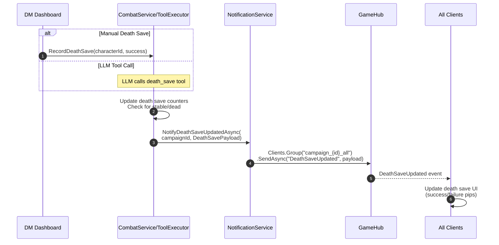

# Implementation Plan: SignalR Documentation Update

**Created:** 2026-01-01  
**Status:** Ready for Implementation  
**Priority:** High (contains critical accuracy fixes)

## Background

Recent bug-fixing activity has caused the SignalR documentation to drift from the actual implementation. An ULTRATHINK analysis comparing the documentation against source code revealed critical discrepancies that could cause developer confusion and silent runtime failures.

## Critical Finding: Live Bug Discovered

### 🚨 Dashboard.razor TurnAdvanced Handler Mismatch

During documentation analysis, a **live bug** was discovered:

| Component | Handler Signature | Server Sends | Works? |
|-----------|------------------|--------------|--------|
| `Dashboard.razor` | `On<int, string, int>` (3 args) | `TurnAdvancedPayload` | ❌ **SILENT FAILURE** |
| `CombatTracker.razor` | `On<TurnAdvancedPayload>` (1 payload) | `TurnAdvancedPayload` | ✅ Works |

**Impact:** Player Dashboard screens do NOT receive turn advancement events because the handler signature doesn't match what the server sends. This is exactly the "silent failure" pattern documented in `AGENT.md`.

**Bug Fix Required:**
```csharp
// File: src/Riddle.Web/Components/Pages/Player/Dashboard.razor
// Line: ~somewhere in OnAfterRenderAsync

// CURRENT (BROKEN):
_hubConnection.On<int, string, int>(GameHubEvents.TurnAdvanced, async (newIndex, currentId, roundNumber) =>
{
    // This handler NEVER fires because server sends TurnAdvancedPayload
});

// FIX:
_hubConnection.On<TurnAdvancedPayload>(GameHubEvents.TurnAdvanced, async payload =>
{
    if (_combatState != null)
    {
        _combatState = _combatState with 
        { 
            CurrentTurnIndex = payload.NewTurnIndex,
            RoundNumber = payload.RoundNumber 
        };
    }
    _currentTurnCombatantId = payload.CurrentCombatantId;
    await InvokeAsync(StateHasChanged);
});
```

**Recommendation:** Fix this bug before or alongside the documentation update.

---

## Analysis Summary

### Source Files Analyzed
- `src/Riddle.Web/Hubs/GameHubEvents.cs` - Event constants and payload records
- `src/Riddle.Web/Hubs/GameHub.cs` - Hub methods
- `src/Riddle.Web/Services/INotificationService.cs` - Interface
- `src/Riddle.Web/Services/NotificationService.cs` - Implementation
- Client handlers in Dashboard.razor, CombatTracker.razor, Campaign.razor

### Documentation Files to Update
- `docs/signalr/events-reference.md`
- `docs/signalr/groups.md`
- `docs/signalr/flows/combat-flow.md`
- `docs/signalr/README.md`

---

## Discrepancies Found

### 1. Events Documented Incorrectly

| Event | Documentation Says | Actual Implementation |
|-------|-------------------|----------------------|
| `TurnAdvanced` | 3 positional args `(int newTurnIndex, string currentCombatantId, int roundNumber)` | `TurnAdvancedPayload` record |
| `InitiativeSet` | 2 positional args `(string characterId, int initiative)` | `InitiativeSetPayload` record |
| `PlayerRollLogged` | Anonymous object only | Two overloads: anon object OR `RollResultPayload` |

### 2. Events Missing from Documentation

| Event | Payload Record | Target Group | Used By |
|-------|----------------|--------------|---------|
| `DeathSaveUpdated` | `DeathSavePayload` | `_all` | Dashboard.razor, Campaign.razor, CombatTracker.razor |

### 3. Dead Code Constants (Exist but No Implementation)

These constants exist in `GameHubEvents.cs` but have no `INotificationService` methods:
- `CombatantAdded`
- `CombatantRemoved`  
- `ConnectionStatusChanged`

**Note:** These are likely future placeholders. Document as "Reserved for future use" or remove if confirmed dead.

### 4. Client Handler Verification (All Others Match)

| Event | Server Sends | Client Expects | Status |
|-------|--------------|----------------|--------|
| `CombatStarted` | `CombatStatePayload` | `CombatStatePayload` | ✅ |
| `CombatEnded` | No args | No args | ✅ |
| `CharacterStateUpdated` | `CharacterStatePayload` | `CharacterStatePayload` | ✅ |
| `DeathSaveUpdated` | `DeathSavePayload` | `DeathSavePayload` | ✅ |
| `PlayerChoicesReceived` | `List<string>` | `List<string>` | ✅ |
| `PlayerChoiceSubmitted` | `PlayerChoicePayload` | `PlayerChoicePayload` | ✅ |
| `PlayerRollLogged` | Anon/RollResultPayload | `RollResultPayload` | ✅ |
| `AtmospherePulseReceived` | `AtmospherePulsePayload` | `AtmospherePulsePayload` | ✅ |
| `NarrativeAnchorUpdated` | `NarrativeAnchorPayload` | `NarrativeAnchorPayload` | ✅ |
| `GroupInsightTriggered` | `GroupInsightPayload` | `GroupInsightPayload` | ✅ |
| `PlayerConnected` | `PlayerConnectionPayload` | `PlayerConnectionPayload` | ✅ |
| `PlayerDisconnected` | `PlayerConnectionPayload` | `PlayerConnectionPayload` | ✅ |

---

## Implementation Steps

### Phase 1: Fix Live Bug ✅ COMPLETED

- [x] Fix `Dashboard.razor` `TurnAdvanced` handler to use `TurnAdvancedPayload`
- [x] Released as v0.20.1 (2026-01-01)

**Note:** The bug was fixed, versioned, and committed in a separate PR before documentation updates.

### Phase 2: Update events-reference.md

- [ ] **FIX** `TurnAdvanced` section - Replace 3-arg documentation with `TurnAdvancedPayload` record
- [ ] **FIX** `InitiativeSet` section - Replace 2-arg documentation with `InitiativeSetPayload` record
- [ ] **ADD** `DeathSaveUpdated` section with full documentation:
  - Target Group: `_all`
  - Payload: `DeathSavePayload`
  - Publisher: `NotificationService.NotifyDeathSaveUpdatedAsync()`
  - Subscribers: `Dashboard.razor`, `Campaign.razor`, `CombatTracker.razor`
- [ ] **UPDATE** `PlayerRollLogged` to show `RollResultPayload` usage (client uses this)
- [ ] **UPDATE** Events Summary Table to add `DeathSaveUpdated`
- [ ] **UPDATE** subscriber lists for `DeathSaveUpdated`

### Phase 3: Update groups.md

- [ ] **ADD** `DeathSaveUpdated` to the `_all` group events list in "Group Usage by Event Type" table

### Phase 4: Update combat-flow.md

- [ ] **FIX** Section 2 (Turn Advancement) - Remove positional args, show `TurnAdvancedPayload`
- [ ] **FIX** Client-side handling code example to use `TurnAdvancedPayload`
- [ ] **ADD** Section 6: Death Save Flow with sequence diagram
- [ ] **UPDATE** Event Summary table at bottom to include `DeathSaveUpdated`

### Phase 5: Update README.md

- [ ] **ADD** `DeathSaveUpdated` to Combat Events in "Event Categories" table
- [ ] Verify architecture diagram is still accurate (appears correct)

### Phase 6: Verification

- [ ] Cross-reference each documented event against `GameHubEvents.cs`
- [ ] Cross-reference each documented payload against actual records
- [ ] Cross-reference each subscriber list against actual `.On<>` handlers
- [ ] Ensure no orphaned events (documented but not implemented)
- [ ] Ensure no undocumented events (implemented but not documented)

---

## New Documentation Content

### DeathSaveUpdated Event (for events-reference.md)

```markdown
### `DeathSaveUpdated`

Fired when a character's death save state changes (success, failure, stabilized, or died).

| Property | Value |
|----------|-------|
| Target Group | `_all` |
| Payload | `DeathSavePayload` |

**Payload:**
```csharp
public record DeathSavePayload(
    string CharacterId,
    string CharacterName,
    int DeathSaveSuccesses,    // 0-3
    int DeathSaveFailures,     // 0-3
    bool IsStable,             // True if 3 successes
    bool IsDead                // True if 3 failures
);
```

**Publisher:** `NotificationService.NotifyDeathSaveUpdatedAsync()`

**Subscribers:** `Dashboard.razor`, `Campaign.razor`, `CombatTracker.razor`

**Notes:** 
- Sent to all participants (`_all` group) so everyone sees death save progress
- DM and players both need visibility for tactical decision-making
```

### Death Save Flow (for combat-flow.md)

```markdown
## 6. Death Save Updates

When a character at 0 HP makes a death save or is stabilized:



### DeathSavePayload

```csharp
public record DeathSavePayload(
    string CharacterId,
    string CharacterName,
    int DeathSaveSuccesses,    // 0-3
    int DeathSaveFailures,     // 0-3
    bool IsStable,
    bool IsDead
);
```

### Client-Side Handling

```csharp
_hubConnection.On<DeathSavePayload>(GameHubEvents.DeathSaveUpdated, async payload =>
{
    // Update character's death save state in local state
    // Trigger UI refresh to show save pips
    await InvokeAsync(StateHasChanged);
});
```
```

### TurnAdvanced Corrected (for events-reference.md)

```markdown
### `TurnAdvanced`

Fired when the turn advances to the next combatant.

| Property | Value |
|----------|-------|
| Target Group | `_all` |
| Payload | `TurnAdvancedPayload` |

**Payload:**
```csharp
public record TurnAdvancedPayload(
    int NewTurnIndex,          // 0-based position in turn order
    string CurrentCombatantId, // ID of combatant whose turn it now is
    int RoundNumber            // Current round number
);
```

**Publisher:** `NotificationService.NotifyTurnAdvancedAsync()`

**Subscribers:** `Dashboard.razor`, `CombatTracker.razor`

**Client-side subscription:**
```csharp
_hubConnection.On<TurnAdvancedPayload>(GameHubEvents.TurnAdvanced, 
    async payload => 
{
    _combatState = _combatState with 
    { 
        CurrentTurnIndex = payload.NewTurnIndex,
        RoundNumber = payload.RoundNumber 
    };
    _currentTurnCombatantId = payload.CurrentCombatantId;
    await InvokeAsync(StateHasChanged);
});
```
```

---

## Acceptance Criteria

- [ ] All documented events match `GameHubEvents.cs` constants
- [ ] All documented payloads match actual record definitions
- [ ] All documented subscriber lists match actual `.On<>` handlers in components
- [ ] `TurnAdvanced` documented as `TurnAdvancedPayload` (not positional args)
- [ ] `InitiativeSet` documented as `InitiativeSetPayload` (not positional args)
- [ ] `DeathSaveUpdated` fully documented with payload, publishers, subscribers
- [ ] Combat flow diagram updated with correct payload patterns
- [ ] Groups table updated with `DeathSaveUpdated`
- [ ] (Optional) Dashboard.razor bug fixed
