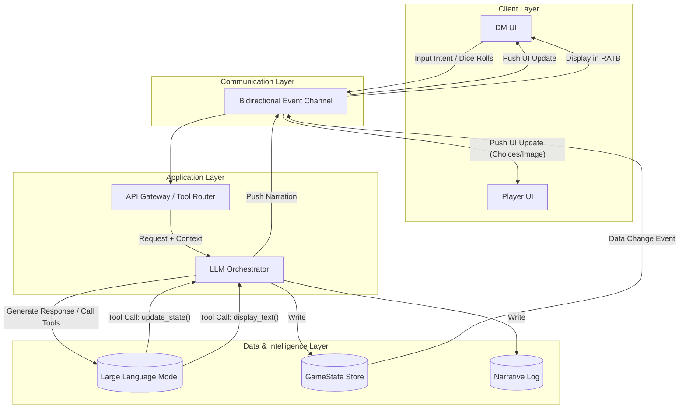
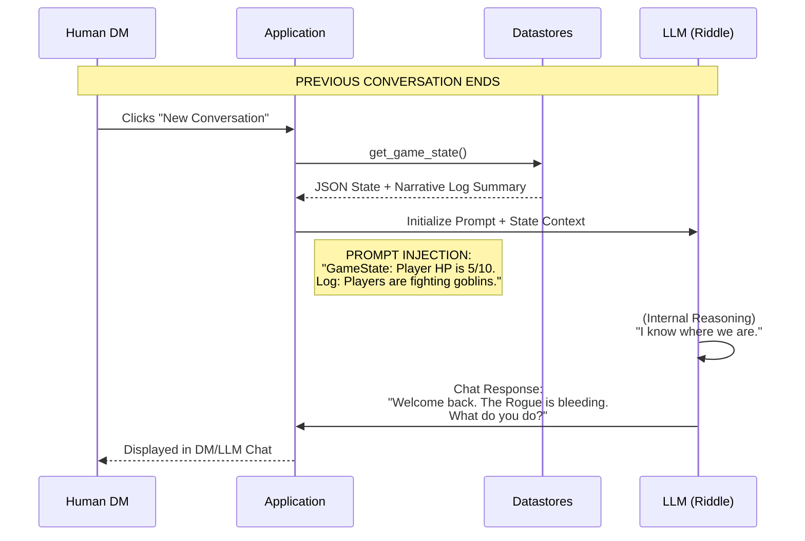
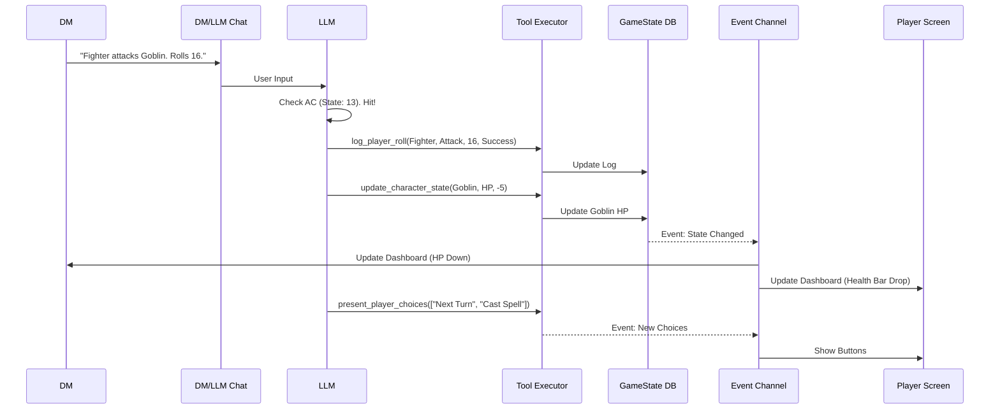

# Project: Riddle - The LLM-Driven Dungeon Master Assistant

## 1. Project Description

### Motivation
Dungeons & Dragons (D&D) is a game of limitless imagination, but it is often gated by complex rule mechanics and the heavy cognitive load required of the Dungeon Master (DM). Novice DMs frequently struggle to track combat math, remember specific campaign details, or improvise engaging narratives on the fly.

**"Riddle"** is a software assistant designed to solve this problem. It acts as an expert co-pilot, leveraging a Large Language Model (LLM) to serve as the game's engine. The LLM possesses deep knowledge of specific campaigns (like *Lost Mine of Phandelver*) and D&D rules, while the software handles the presentation and state management. The goal is to allow a Human DM to focus on storytelling and social interaction, offloading math, rules arbitration, and content retrieval to the system.

### Target Play Environment: Remote Multiplayer

Riddle is designed for **remote multiplayer sessions** where:

- **The DM** runs Riddle on their computer, accessing the DM Dashboard
- **Players** (typically 3-5) each access Riddle from their own computers via their browser
- **Voice communication** happens through a separate channel (Discord, etc.)

```
┌─────────────────────────────────────────────────────────────┐
│                    Discord Voice Chat                        │
├─────────────────────────────────────────────────────────────┤
│   DM (Computer 1)     Player 1      Player 2      Player 3  │
│   ┌─────────────┐     ┌────────┐    ┌────────┐   ┌────────┐ │
│   │ Riddle DM   │     │ Riddle │    │ Riddle │   │ Riddle │ │
│   │ Dashboard   │     │ Player │    │ Player │   │ Player │ │
│   │             │     │ View   │    │ View   │   │ View   │ │
│   └─────────────┘     └────────┘    └────────┘   └────────┘ │
│         ↓                  ↓             ↓            ↓     │
│   ┌─────────────────────────────────────────────────────┐   │
│   │              Riddle SignalR Hub                     │   │
│   │         (Real-time state sync)                      │   │
│   └─────────────────────────────────────────────────────┘   │
└─────────────────────────────────────────────────────────────┘
```

This architecture means:
- All game state is synchronized in real-time across all connected clients
- Players see their own character card, scene images, and choice buttons
- The DM sees everything and controls the narrative through Riddle
- Voice chat remains separate, keeping the social experience intact

### Campaign Instance vs Play Session Hierarchy

A critical distinction in Riddle's data model is the separation between **Campaign Instances** and **Play Sessions**:

#### Campaign Instance (The Adventure)
A **Campaign Instance** represents an entire playthrough of a campaign module with a specific party. It spans weeks or months and contains all persistent game state:
- The party composition and character states
- Quest progress and narrative history
- Current location in the campaign
- Preferences and accumulated context

#### Play Session (A Game Night)
A **Play Session** represents an individual game night within a Campaign Instance—a single sitting where players gather to play. Each Campaign Instance contains many Play Sessions over its lifetime.

#### Why This Matters: The Parallel Campaign Example

Consider this scenario: On September 1st, a DM wants to start a brand new campaign with 6 characters playing *Lost Mine of Phandelver*. Throughout this adventure, they will leverage multiple LLM conversations across many game nights, as the LLM has limited memory and cannot retain context between sessions.

Now imagine the same DM runs a second group through *Lost Mine of Phandelver* in parallel—same campaign module, but different characters, different choices, different outcomes.

**Each group requires its own Campaign Instance:**

```
Campaign Instance: "Tuesday Night Group"
├── Module: Lost Mine of Phandelver
├── Party: Thorin (Fighter), Luna (Wizard), Shade (Rogue)...
├── Current State: Chapter 2, Cragmaw Hideout
├── Narrative Log: "Defeated the goblin ambush, rescued Sildar..."
└── Play Sessions:
    ├── Session 1 (Sept 1) - Character creation, goblin ambush
    ├── Session 2 (Sept 8) - Explored Cragmaw Hideout
    └── Session 3 (Sept 15) - Rescued Sildar, traveled to Phandalin

Campaign Instance: "Saturday Group"  
├── Module: Lost Mine of Phandelver (same module!)
├── Party: Grimm (Paladin), Whisper (Bard), Talon (Ranger)...
├── Current State: Chapter 1, still on the road
├── Narrative Log: "TPK'd by goblins, rerolled characters..."
└── Play Sessions:
    ├── Session 1 (Sept 3) - Original party died to goblins
    └── Session 2 (Sept 10) - New characters, cautious approach
```

This structure allows Riddle to:
- Maintain completely separate game states for each group
- Inject the correct context when the LLM conversation resets
- Track progress across individual game nights
- Support a single DM running multiple parallel campaigns

### Key Datastores

To support a system where the "Brain" (LLM) is stateless and the "Body" (Software) must maintain continuity, we require specialized datastores:

1.  **The GameState Store (The "Single Source of Truth")**
    *   **Purpose:** Since LLMs operate within finite context windows and often reset, we cannot rely on them to remember current Health Points (HP), player locations, or active inventory. This store persists the absolute current reality of the Campaign Instance.
    *   **Contents:** Character stats, current HP, active conditions (Poisoned, Prone), current location ID, and the turn order tracker.

2.  **The Narrative Log (The "Compressed Memory")**
    *   **Purpose:** To handle the constraint of limited input context. When the Human DM resets the conversation or the play session times out, the LLM loses all memory. This store acts as a journal of high-level events scoped to the Campaign Instance.
    *   **Contents:** Summaries of past events ("The party defeated the goblins and found a map"). When a new conversation starts, the system feeds this summary to the LLM so it can "catch up" instantly without needing the full chat history.

3.  **The Media Library**
    *   **Purpose:** To support immersion without bloating the LLM prompt with raw image data.
    *   **Contents:** References to generated scene images and ambient audio tracks selected by the DM.

### Player Onboarding Flow

When starting a new campaign with remote players, the following flow establishes the multiplayer session:

#### Step 1: DM Creates Campaign & Characters
```
1. DM logs in via Google OAuth
2. DM creates a new Campaign Instance (e.g., "Tuesday Night Group")
3. DM adds player characters to the campaign:
   - Option A: Upload character sheet (PDF/image) → LLM parses → DM reviews/corrects
   - Option B: Manual entry via form
4. Campaign generates a persistent invite link (e.g., /join/ABC123)
5. DM shares link in Discord
```

#### Step 2: Players Join & Claim Characters
```
1. Player receives link from DM via Discord
2. Player clicks link → Lands on Join page
3. Player logs in via Google OAuth (if not already)
4. Player sees list of unclaimed characters in the campaign
5. Player selects their character (e.g., "I'm playing Thorin")
6. Character is linked to player's account
7. Player is redirected to Player Dashboard
```

#### Step 3: Session Play
```
- DM sees full DM Dashboard (chat with Riddle, all stats, full control)
- Players see limited Player Dashboard:
  - Their character card only
  - Scene image (pushed from DM)
  - Read-aloud text (synced in real-time)
  - Choice buttons (when Riddle asks for decisions)
  - Quest summary, time of day, location
```

### User Interface (UI) Elements

The UI is bifurcated to support two distinct user types: the Human DM (Operator) and the Players (Participants).

#### A. Dungeon Master UI (The Operator Station)
*   **DM/LLM Chat:** A conversational interface where the DM types intent ("The players want to attack") and receives strategic advice, rule clarifications, and secret information (e.g., "The Goblin rolled 18 Stealth").
*   **Read Aloud Text Box (RATB):** A large, read-only display that presents the exact prose the DM should read to the players to ensure high-quality, atmospheric narration.
*   **GameState Dashboard:** A "God Mode" view displaying all player stats, enemy HP (hidden from players), and active conditions. It allows the DM to manually override data if necessary.
*   **Party Management:** Character creation, editing, and invite link generation for remote players.
*   **Input Controls:** Quick-entry forms for the DM to input raw dice rolls provided by players (e.g., "Rogue rolled 15").

#### B. Player UI (The Immersive Dashboard)

The Player Dashboard provides an immersive, focused view for remote players:

```
┌──────────────────────────────────────────────────────────────┐
│  RIDDLE - Player Dashboard               [Elara] [Logout]   │
├──────────────────────────────────────────────────────────────┤
│                                                              │
│  ┌─────────────────────┐  ┌─────────────────────────────┐   │
│  │  🖼️ Scene Image    │  │  📜 Read-Aloud Text        │   │
│  │                     │  │  "The goblin cave looms    │   │
│  │  [Dark cave        │  │   before you, the stench   │   │
│  │   entrance]        │  │   of wet fur and rot..."   │   │
│  │                     │  │                             │   │
│  └─────────────────────┘  └─────────────────────────────┘   │
│                                                              │
│  ┌─────────────────────┐  ┌─────────────────────────────┐   │
│  │  ⚔️ My Character    │  │  📋 Quest Summary          │   │
│  │  Elara (Wizard L3) │  │  • Deliver goods to Phan.  │   │
│  │  HP: 18/22         │  │  • Rescue Sildar           │   │
│  │  AC: 12            │  │                             │   │
│  │  [Poisoned] ❌     │  ├─────────────────────────────┤   │
│  │                     │  │  🌤️ Time: Afternoon        │   │
│  │  Spell Slots: 2/4  │  │  📍 Loc: Goblin Cave       │   │
│  └─────────────────────┘  └─────────────────────────────┘   │
│                                                              │
│  ┌──────────────────────────────────────────────────────┐   │
│  │  🎯 What do you do?                                  │   │
│  │  ┌───────────┐ ┌───────────┐ ┌─────────────────────┐ │   │
│  │  │  Attack   │ │  Sneak    │ │  Cast Detect Magic  │ │   │
│  │  └───────────┘ └───────────┘ └─────────────────────┘ │   │
│  └──────────────────────────────────────────────────────┘   │
│                                                              │
└──────────────────────────────────────────────────────────────┘
```

**Key Components:**
*   **Scene Image:** The current visual scene (pushed by DM/Riddle)
*   **Read-Aloud Text:** Atmospheric narration synced from DM's RATB
*   **Character Card:** Only the player's own character (HP, AC, conditions, spell slots)
*   **Quest Summary:** Active quests (abbreviated view)
*   **World State:** Time of day, current location, weather
*   **Choice Pad:** Dynamic buttons for player decisions (sent via `present_player_choices`)

**Information Restrictions:**
*   Players CANNOT see enemy HP (only descriptive health states like "bloodied")
*   Players CANNOT see DM chat with Riddle
*   Players CANNOT see other players' character details (unless DM enables it)

---

## 2. Architectural Overview

### Real-Time Communication Strategy
The architecture relies on a **persistent, bidirectional event channel** (similar to WebSockets or SignalR) to synchronize the game state.

**Why is this needed?**
The LLM functions asynchronously. When the LLM executes a tool (e.g., `update_character_state`), the backend database updates immediately. The "Event Channel" detects this change and pushes a notification to the DM's screen (to update the HP bar) and the Players' screens (to update the image or status) without the user needing to refresh the page.

### High-Level Architecture



### The "Stateless Recovery" Flow
This diagram illustrates how the system handles the critical constraint where the LLM context is wiped.



### Tool Execution Loop
This diagram details how a player action propagates through the system to update the UI.


