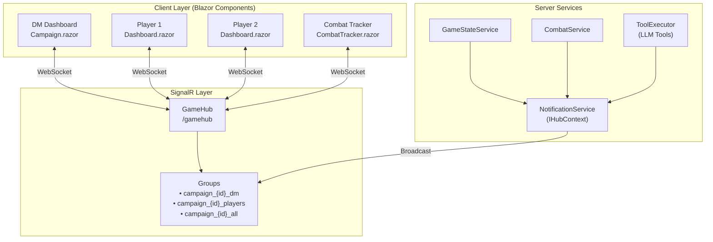
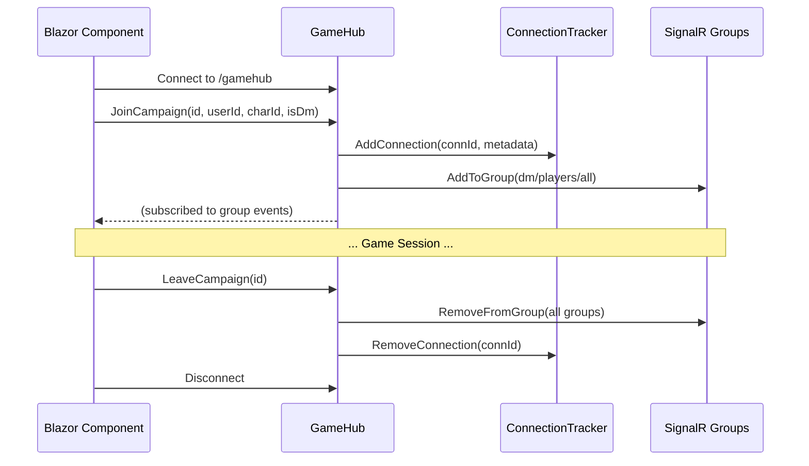

# SignalR Real-Time Communication Architecture

This documentation describes the SignalR-based real-time communication system in Project Riddle. SignalR enables bidirectional communication between the server and connected clients (DM dashboard, player dashboards).

## Quick Reference

| Document | Description |
|----------|-------------|
| [groups.md](groups.md) | SignalR group naming conventions and membership |
| [events-reference.md](events-reference.md) | Complete event catalog with payloads |
| [flows/](flows/) | Scenario-specific sequence diagrams |

## Architecture Overview



## Communication Patterns

### 1. Client → Server (Hub Methods)

Clients invoke hub methods directly on `GameHub`:

```csharp
await _hubConnection.SendAsync("JoinCampaign", campaignId, userId, characterId, isDm);
await _hubConnection.SendAsync("LeaveCampaign", campaignId);
await _hubConnection.SendAsync("SubmitChoice", campaignId, characterId, characterName, choice);
```

### 2. Server → Client (Event Broadcasting)

Server-side services use `NotificationService` (which wraps `IHubContext<GameHub>`) to broadcast events to specific groups:

```csharp
// Service code
await _notificationService.NotifyPlayerChoicesAsync(campaignId, choices);

// This sends to the players group
await _hubContext.Clients.Group($"campaign_{campaignId}_players")
    .SendAsync("PlayerChoicesReceived", choices);
```

### 3. Client Event Subscription

Blazor components subscribe to events using the `On` method:

```csharp
_hubConnection.On<List<string>>(GameHubEvents.PlayerChoicesReceived, async choices => {
    // Handle received choices
    await InvokeAsync(StateHasChanged);
});
```

## Key Components

| Component | Role | File |
|-----------|------|------|
| `GameHub` | SignalR hub - handles client connections and direct invocations | `Hubs/GameHub.cs` |
| `GameHubEvents` | Constants for all event names + payload records | `Hubs/GameHubEvents.cs` |
| `NotificationService` | Abstraction for broadcasting events via `IHubContext` | `Services/NotificationService.cs` |
| `ConnectionTracker` | Tracks active connections and their metadata | `Services/ConnectionTracker.cs` |

## Event Categories

| Category | Target Audience | Examples |
|----------|-----------------|----------|
| **Character Events** | DM only | `CharacterClaimed`, `CharacterReleased` |
| **Connection Events** | DM only | `PlayerConnected`, `PlayerDisconnected` |
| **Game State Events** | Varies | `CharacterStateUpdated` (all), `ReadAloudTextReceived` (DM) |
| **Player Interaction** | Varies | `PlayerChoicesReceived` (players), `PlayerChoiceSubmitted` (DM) |
| **Combat Events** | All | `CombatStarted`, `TurnAdvanced`, `CombatEnded` |
| **Atmospheric Events** | Players only | `AtmospherePulseReceived`, `NarrativeAnchorUpdated`, `GroupInsightTriggered` |

## Connection Lifecycle



## See Also

- [groups.md](groups.md) - Detailed group membership rules
- [events-reference.md](events-reference.md) - All events with payloads
- [flows/player-lifecycle-flow.md](flows/player-lifecycle-flow.md) - Player connection flow
- [flows/combat-flow.md](flows/combat-flow.md) - Combat event sequence
- [flows/player-choice-flow.md](flows/player-choice-flow.md) - Choice submission flow
- [flows/atmospheric-events-flow.md](flows/atmospheric-events-flow.md) - Atmospheric effects
