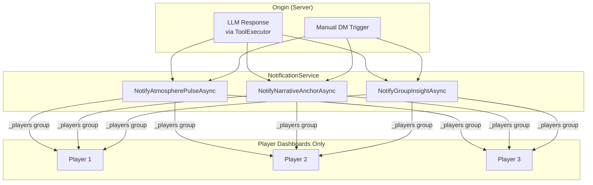
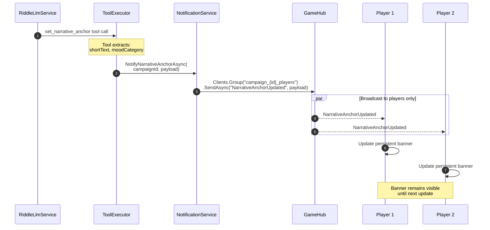
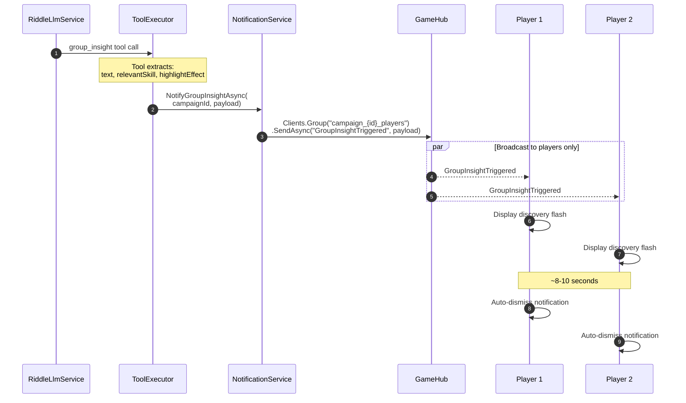
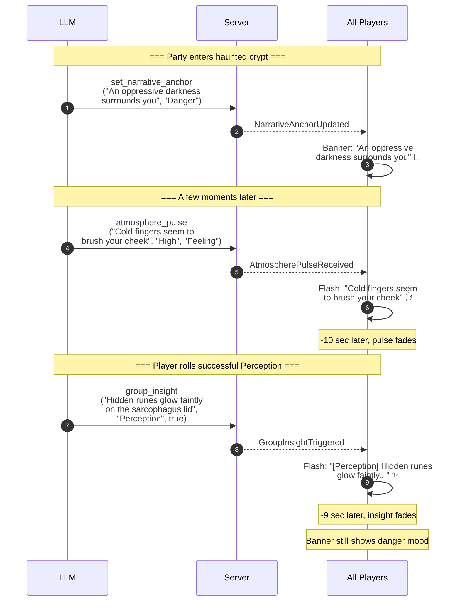

# Atmospheric Events Flow

This document describes the SignalR communication for atmospheric events—immersive effects that enhance the player experience during gameplay. These events are **player-only**; the DM sees them in the LLM chat but doesn't receive them via SignalR.

## Overview

Atmospheric events create ambient storytelling effects on player screens:

| Event | Purpose | Duration | UI Element |
|-------|---------|----------|------------|
| **Atmosphere Pulse** | Fleeting sensory detail | ~10 sec auto-fade | Transient overlay |
| **Narrative Anchor** | Current scene vibe | Persistent until changed | Top banner |
| **Group Insight** | Discovery notification | ~8-10 sec auto-dismiss | Flash notification |



## 1. Atmosphere Pulse

Fleeting, evocative sensory text that creates momentary immersion. Auto-fades after approximately 10 seconds.

### Use Cases
- "A cold draft whispers past your neck"
- "The distant sound of dripping water echoes"
- "A faint smell of sulfur tickles your nose"

### Sequence Diagram


### AtmospherePulsePayload

```csharp
public record AtmospherePulsePayload(
    string Text,           // The sensory description
    string? Intensity,     // "Low", "Medium", "High" - controls animation speed/color
    string? SensoryType    // "Sound", "Smell", "Visual", "Feeling" - for icon selection
);
```

### Client-Side Handling (Dashboard.razor)

```csharp
_hubConnection.On<AtmospherePulsePayload>(GameHubEvents.AtmospherePulseReceived, async payload =>
{
    _currentAtmospherePulse = payload;
    _showAtmospherePulse = true;
    
    await InvokeAsync(StateHasChanged);
    
    // Auto-dismiss after 10 seconds
    _ = Task.Run(async () =>
    {
        await Task.Delay(TimeSpan.FromSeconds(10));
        _showAtmospherePulse = false;
        await InvokeAsync(StateHasChanged);
    });
});
```

### UI Styling by Intensity

| Intensity | Animation | Color | Opacity |
|-----------|-----------|-------|---------|
| Low | Slow fade | Soft gray | 60% |
| Medium | Standard fade | Neutral | 80% |
| High | Quick pulse | Accent color | 100% |

### UI Styling by Sensory Type

| Sensory Type | Icon | Suggested Style |
|--------------|------|-----------------|
| Sound | 🔊 / ear icon | Waveform background |
| Smell | 👃 / nose icon | Wispy/smoke effect |
| Visual | 👁️ / eye icon | Shimmer effect |
| Feeling | ✋ / hand icon | Ripple effect |

---

## 2. Narrative Anchor

A persistent banner at the top of player screens showing the "current vibe" of the scene. Remains until explicitly updated.

### Use Cases
- "The Ghost is still weeping nearby"
- "Tension hangs heavy in the air"
- "You feel eyes watching from the shadows"

### Sequence Diagram



### NarrativeAnchorPayload

```csharp
public record NarrativeAnchorPayload(
    string ShortText,      // Max ~10 words - the current narrative state
    string? MoodCategory   // "Danger", "Mystery", "Safety", "Urgency" - for styling
);
```

### Client-Side Handling (Dashboard.razor)

```csharp
_hubConnection.On<NarrativeAnchorPayload>(GameHubEvents.NarrativeAnchorUpdated, payload =>
{
    _currentNarrativeAnchor = payload;
    
    // No auto-dismiss - this stays until replaced
    InvokeAsync(StateHasChanged);
    
    return Task.CompletedTask;
});
```

### UI Styling by Mood Category

| Mood | Border Color | Background | Icon |
|------|--------------|------------|------|
| Danger | Red | Dark red tint | ⚠️ |
| Mystery | Purple | Dark purple tint | ❓ |
| Safety | Green | Dark green tint | 🛡️ |
| Urgency | Orange | Dark orange tint | ⏰ |
| (default) | Gray | Neutral | — |

---

## 3. Group Insight

A flash notification for collective discoveries—clues, secrets, or important information the entire party learns simultaneously.

### Use Cases
- "[Perception] You all notice the hidden door behind the tapestry"
- "[History] This symbol belongs to an ancient cult"
- "[Nature] These tracks were made by something very large"

### Sequence Diagram



### GroupInsightPayload

```csharp
public record GroupInsightPayload(
    string Text,           // The clue or information discovered
    string RelevantSkill,  // "Perception", "History", "Nature", etc. - for UI labeling
    bool HighlightEffect   // If true, text shimmers/glows to indicate critical clue
);
```

### Client-Side Handling (Dashboard.razor)

```csharp
_hubConnection.On<GroupInsightPayload>(GameHubEvents.GroupInsightTriggered, async payload =>
{
    _currentGroupInsight = payload;
    _showGroupInsight = true;
    
    await InvokeAsync(StateHasChanged);
    
    // Auto-dismiss after 8-10 seconds
    _ = Task.Run(async () =>
    {
        await Task.Delay(TimeSpan.FromSeconds(9));
        _showGroupInsight = false;
        await InvokeAsync(StateHasChanged);
    });
});
```

### UI Considerations

- Display the `RelevantSkill` as a label/badge (e.g., "[Perception]")
- If `HighlightEffect` is true, add shimmer/glow animation to emphasize importance
- Consider a distinct sound effect for critical insights

---

## Combined Flow Example

A typical narrative moment might trigger multiple atmospheric events:



## State Management (Dashboard.razor)

```csharp
// Atmospheric event state
private AtmospherePulsePayload? _currentAtmospherePulse;
private bool _showAtmospherePulse;

private NarrativeAnchorPayload? _currentNarrativeAnchor;  // Persistent, no show flag

private GroupInsightPayload? _currentGroupInsight;
private bool _showGroupInsight;
```

## Event Summary

| Event | Direction | Target | Payload | Duration |
|-------|-----------|--------|---------|----------|
| `AtmospherePulseReceived` | S→C | `_players` | `AtmospherePulsePayload` | ~10 sec |
| `NarrativeAnchorUpdated` | S→C | `_players` | `NarrativeAnchorPayload` | Persistent |
| `GroupInsightTriggered` | S→C | `_players` | `GroupInsightPayload` | ~8-10 sec |

## Key Points

1. **Players only**: All atmospheric events go to `_players` group only. The DM sees these in the chat/LLM response but doesn't need SignalR delivery.

2. **Non-blocking**: These events are fire-and-forget. They don't require acknowledgment or response from players.

3. **Layerable**: Multiple events can be active simultaneously (e.g., narrative anchor + atmosphere pulse + group insight all showing at once).

4. **LLM-driven**: Most atmospheric events originate from LLM tool calls, making them contextually appropriate to the narrative.

5. **Graceful handling**: If an event arrives while a previous one is still showing:
   - Atmosphere Pulse: Replace the current pulse (reset timer)
   - Narrative Anchor: Replace immediately (it's meant to be the current state)
   - Group Insight: Consider queueing or replacing based on UX preference

6. **Reconnection**: After reconnection, the narrative anchor state should be reloaded from the database (if persisted) or the player will see the next update.
