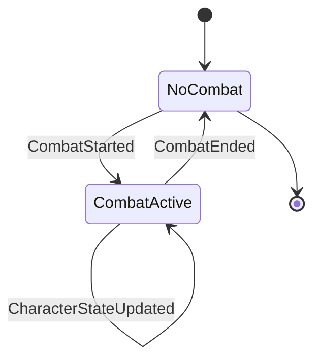
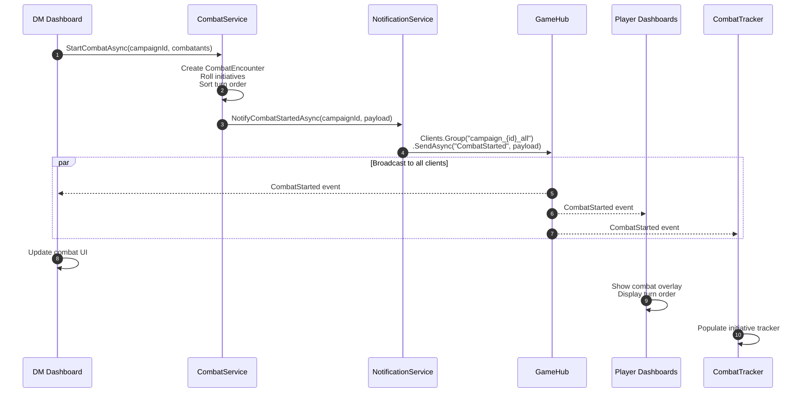
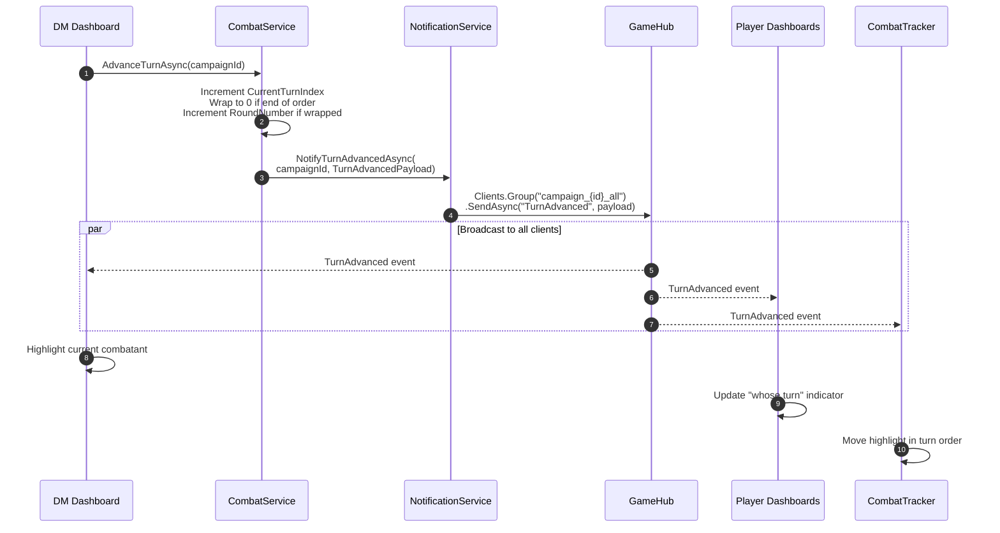
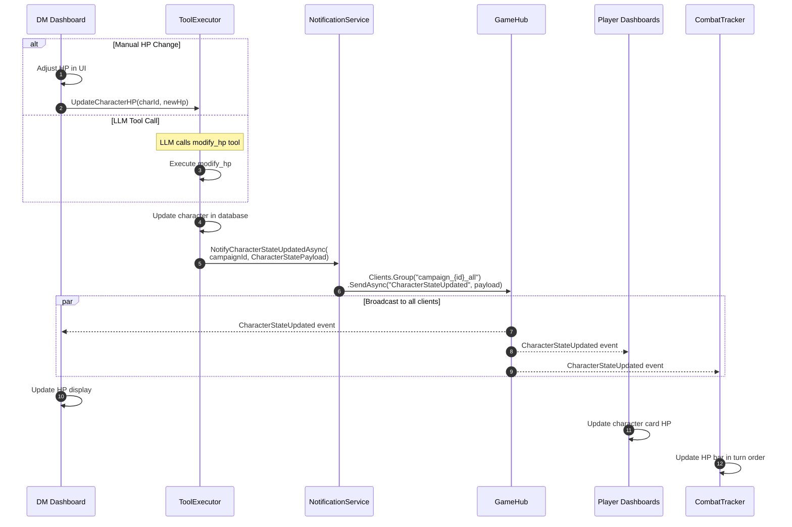
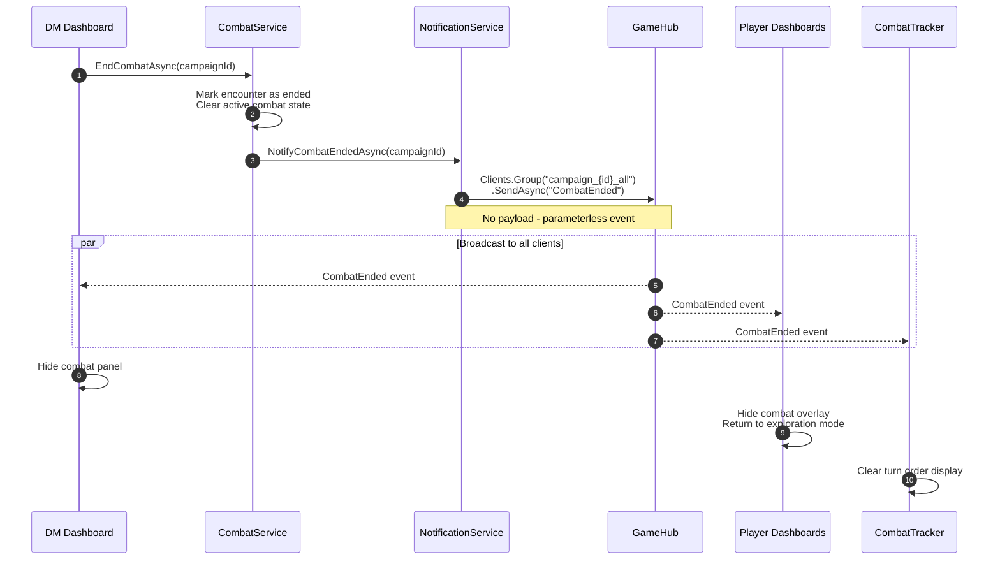
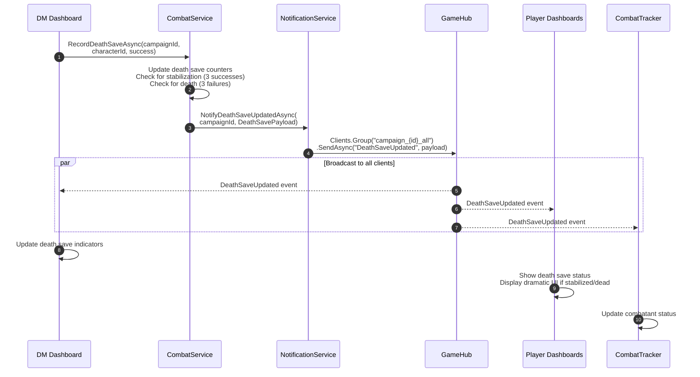
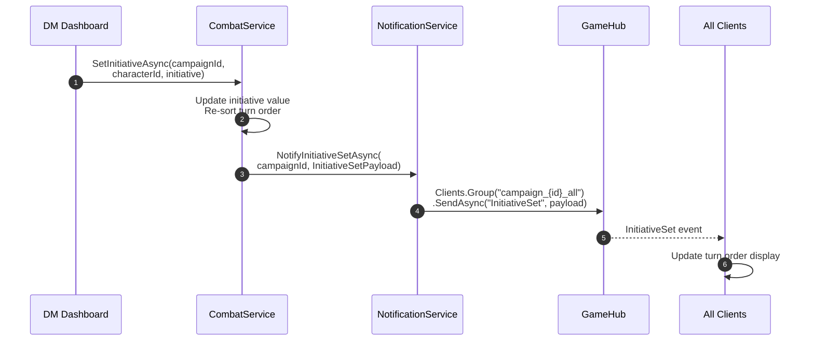
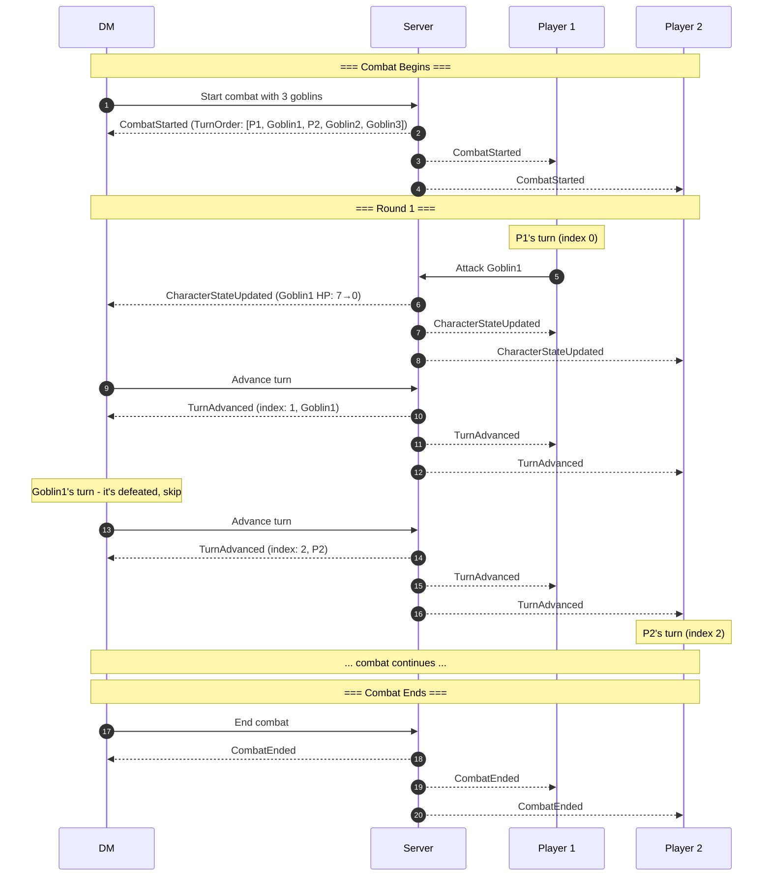

# Combat Flow

This document describes the SignalR communication during combat encounters, including starting combat, turn management, HP updates, and ending combat.

## Overview

Combat in Project Riddle involves real-time synchronization between all participants:
- **DM Dashboard**: Initiates and manages combat
- **Player Dashboards**: Receive combat state updates, see turn order
- **Combat Tracker**: Standalone component showing initiative order

## Combat Lifecycle



## 1. Starting Combat

When the DM or LLM initiates combat:



### CombatStatePayload

```csharp
public record CombatStatePayload(
    string? CombatId,
    bool IsActive,           // true when combat starts
    int RoundNumber,         // starts at 1
    List<CombatantInfo> TurnOrder,
    int CurrentTurnIndex     // 0-based, first combatant
);

public record CombatantInfo(
    string Id,
    string Name,
    string Type,             // "PC", "NPC", "Enemy"
    int Initiative,
    int CurrentHp,
    int MaxHp,
    bool IsDefeated,
    bool IsSurprised
);
```

### Client-Side Handling (Dashboard.razor)

```csharp
_hubConnection.On<CombatStatePayload>(GameHubEvents.CombatStarted, async payload =>
{
    _combatState = payload;
    _isInCombat = true;
    await InvokeAsync(StateHasChanged);
});
```

## 2. Turn Advancement

When the current combatant's turn ends:



### TurnAdvancedPayload

```csharp
public record TurnAdvancedPayload(
    int NewTurnIndex,           // 0-based position in turn order
    string CurrentCombatantId,  // ID of combatant whose turn it is
    int RoundNumber             // Current round number
);
```

### Server-Side Sending

```csharp
// Server sends (NotificationService):
await _hubContext.Clients.Group(AllGroup(campaignId))
    .SendAsync(GameHubEvents.TurnAdvanced, 
        new TurnAdvancedPayload(newTurnIndex, currentCombatantId, roundNumber),
        ct);
```

### Client-Side Handling

```csharp
_hubConnection.On<TurnAdvancedPayload>(GameHubEvents.TurnAdvanced, 
    async (payload) =>
{
    if (_combatState != null)
    {
        _combatState = _combatState with 
        { 
            CurrentTurnIndex = payload.NewTurnIndex,
            RoundNumber = payload.RoundNumber 
        };
    }
    _currentTurnCombatantId = payload.CurrentCombatantId;
    await InvokeAsync(StateHasChanged);
});
```

## 3. HP Updates During Combat

When damage is dealt or healing occurs:



### CharacterStatePayload

```csharp
public record CharacterStatePayload(
    string CharacterId,
    string Key,      // "CurrentHp", "Conditions", "TempHp", etc.
    object Value     // The new value (int for HP, List<string> for conditions)
);
```

### Client-Side Handling (CombatTracker.razor)

```csharp
_hubConnection.On<CharacterStatePayload>(GameHubEvents.CharacterStateUpdated, async payload =>
{
    // Find combatant in turn order and update their HP
    var combatant = _combatState?.TurnOrder
        .FirstOrDefault(c => c.Id == payload.CharacterId);
    
    if (combatant != null && payload.Key == "CurrentHp")
    {
        // Update the combatant's HP (requires reconstructing the list)
        // ... update logic ...
    }
    
    await InvokeAsync(StateHasChanged);
});
```

## 4. Ending Combat

When combat concludes (all enemies defeated, party flees, etc.):



### Client-Side Handling

```csharp
// Note: No parameters - use parameterless On()
_hubConnection.On(GameHubEvents.CombatEnded, async () =>
{
    _combatState = null;
    _isInCombat = false;
    await InvokeAsync(StateHasChanged);
});
```

## 5. Death Save Updates

When a character at 0 HP makes a death saving throw:



### DeathSavePayload

```csharp
public record DeathSavePayload(
    string CharacterId,
    string CharacterName,
    int DeathSaveSuccesses,    // 0-3
    int DeathSaveFailures,     // 0-3
    bool IsStable,             // True if 3 successes reached
    bool IsDead                // True if 3 failures reached
);
```

### Death Save Rules

Per D&D 5E rules:
- A character at 0 HP is **unconscious** and must make death saving throws at the start of their turn
- Rolling 10+ is a **success**, 9 or below is a **failure**
- Rolling a **natural 20** grants 2 successes and the character regains 1 HP
- Rolling a **natural 1** counts as 2 failures
- **3 successes** → character stabilizes (no longer needs to roll)
- **3 failures** → character dies
- Taking damage at 0 HP adds a failure (or 2 on a critical hit)
- Receiving healing resets death saves and restores consciousness

### Client-Side Handling

```csharp
_hubConnection.On<DeathSavePayload>(GameHubEvents.DeathSaveUpdated, 
    async (payload) =>
{
    // Update local character state
    var character = _party.FirstOrDefault(c => c.Id == payload.CharacterId);
    if (character != null)
    {
        character.DeathSaveSuccesses = payload.DeathSaveSuccesses;
        character.DeathSaveFailures = payload.DeathSaveFailures;
        
        if (payload.IsStable)
        {
            // Show "Stabilized!" notification
        }
        else if (payload.IsDead)
        {
            // Show death notification with dramatic effect
        }
    }
    await InvokeAsync(StateHasChanged);
});
```

---

## 6. Initiative Setting

When initiative is manually set or re-rolled:



### InitiativeSetPayload

```csharp
public record InitiativeSetPayload(
    string CharacterId,
    int Initiative
);
```

## Full Combat Session Flow



## Event Summary

| Event | Direction | Target | Payload | When |
|-------|-----------|--------|---------|------|
| `CombatStarted` | S→C | `_all` | `CombatStatePayload` | DM/LLM initiates combat |
| `TurnAdvanced` | S→C | `_all` | `TurnAdvancedPayload` | Turn passes to next combatant |
| `CharacterStateUpdated` | S→C | `_all` | `CharacterStatePayload` | HP/conditions change |
| `DeathSaveUpdated` | S→C | `_all` | `DeathSavePayload` | Death save recorded |
| `InitiativeSet` | S→C | `_all` | `InitiativeSetPayload` | Initiative value set |
| `CombatEnded` | S→C | `_all` | None | Combat concludes |

## Key Points

1. **All combat events go to `_all` group**: Both DM and players need real-time combat updates.

2. **Turn order is sent once**: The full `TurnOrder` list is only sent in `CombatStarted`. Subsequent `TurnAdvanced` events just update the index.

3. **HP sync is separate**: `CharacterStateUpdated` handles HP changes independently from combat flow—this allows HP updates outside of combat too.

4. **Parameterless CombatEnded**: This event has no payload. Clients should reset all combat state when received.

5. **Initiative re-sorting**: When `InitiativeSet` is received, clients may need to re-sort their local turn order display.
