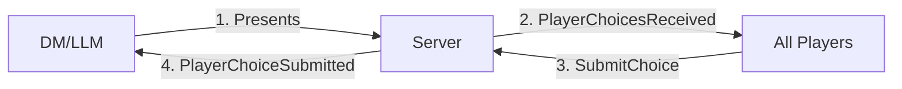
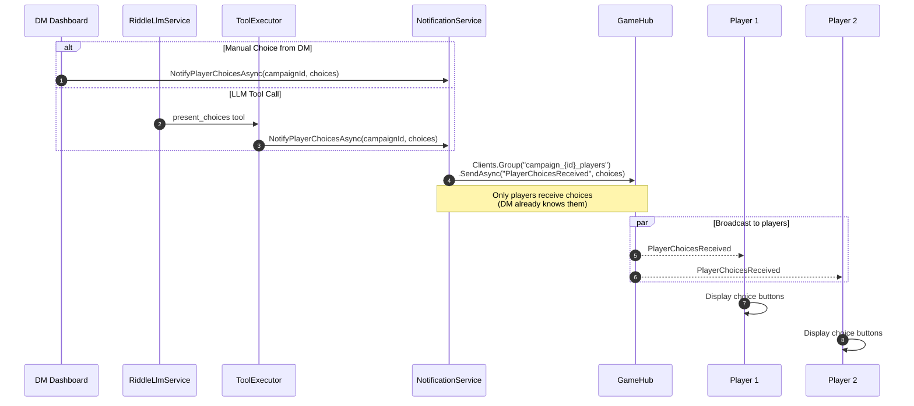
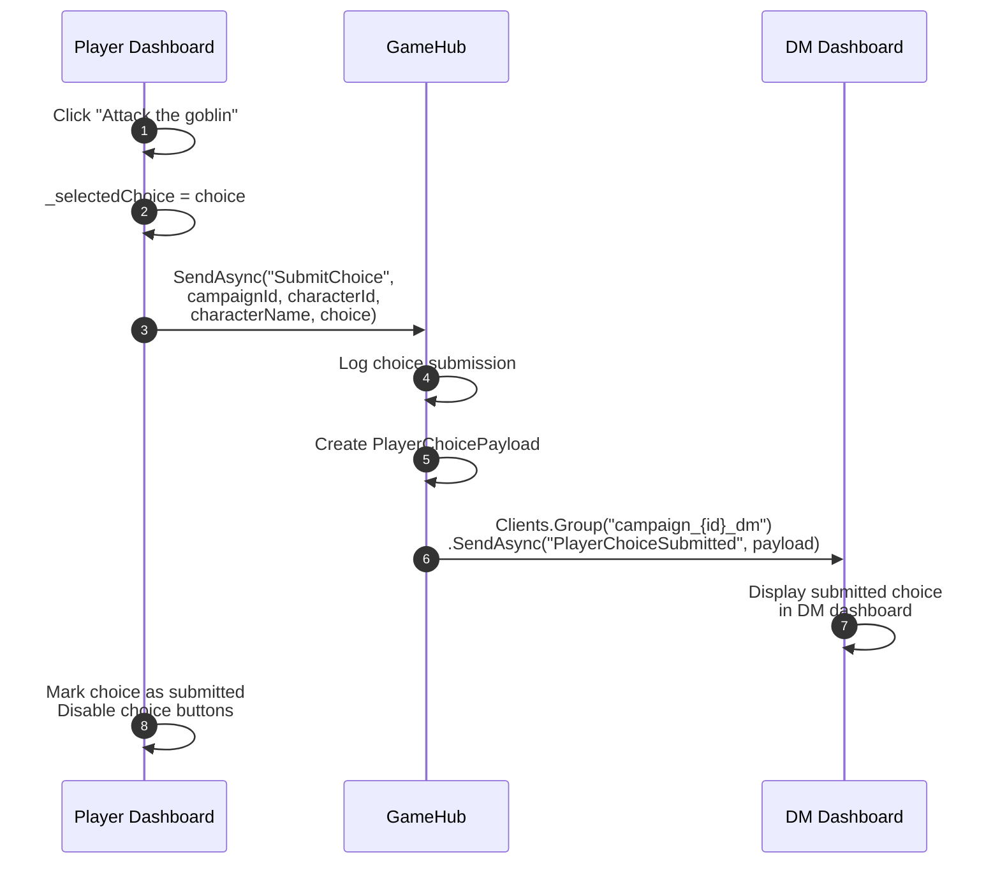
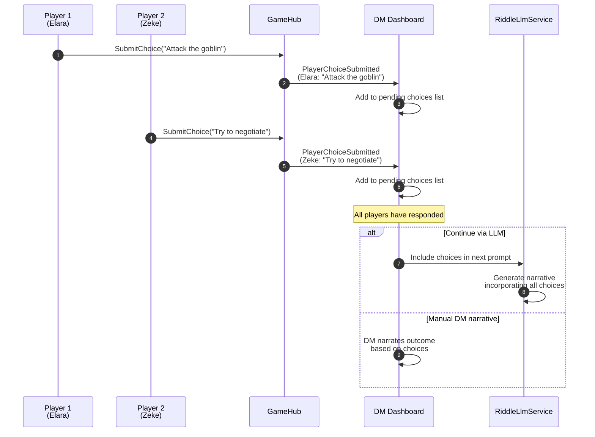
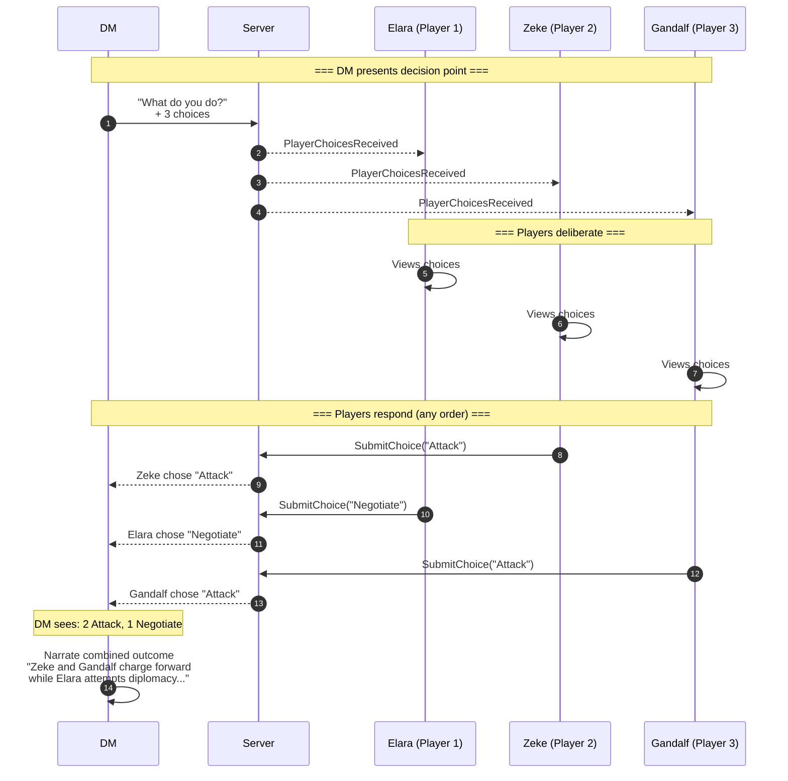

# Player Choice Flow

This document describes the SignalR communication for the player choice system, where the DM/LLM presents options to players and collects their responses.

## Overview

The player choice flow is a request-response pattern:
1. **DM/LLM presents choices** → Server broadcasts options to all players
2. **Players select their choice** → Each player sends their selection to the DM
3. **DM collects responses** → LLM or DM incorporates choices into the narrative



## 1. DM/LLM Presents Choices

When the narrative reaches a decision point:



### Payload Format

```csharp
// Simple list of choice strings
List<string> choices = new List<string>
{
    "Attack the goblin",
    "Try to negotiate",
    "Flee into the forest",
    "Search the room for another exit"
};
```

### Client-Side Handling (Dashboard.razor)

```csharp
_hubConnection.On<List<string>>(GameHubEvents.PlayerChoicesReceived, async choices =>
{
    _availableChoices = choices;
    _selectedChoice = null;  // Reset any previous selection
    _hasSubmittedChoice = false;
    
    await InvokeAsync(StateHasChanged);
});
```

### UI Considerations

- Choices appear as buttons/cards on the player dashboard
- Previous selections are cleared when new choices arrive
- Players should see clear visual feedback that choices are available

## 2. Player Submits Choice

When a player clicks a choice option:



### Hub Method

```csharp
// GameHub.cs
public async Task SubmitChoice(Guid campaignId, string characterId, string characterName, string choice)
{
    _logger.LogInformation(
        "Choice submitted: Campaign={CampaignId}, Character={CharacterId}, Choice={Choice}",
        campaignId, characterId, choice);

    var payload = new PlayerChoicePayload(characterId, characterName, choice, DateTime.UtcNow);
    
    // Send to DM only
    await Clients.Group($"campaign_{campaignId}_dm").SendAsync(
        GameHubEvents.PlayerChoiceSubmitted, payload);
}
```

### PlayerChoicePayload

```csharp
public record PlayerChoicePayload(
    string CharacterId,
    string CharacterName,
    string Choice,          // The exact choice text selected
    DateTime Timestamp      // When the choice was made
);
```

### Client-Side Submission (Dashboard.razor)

```csharp
private async Task SubmitChoice(string choice)
{
    if (selectedCharacter == null || _hubConnection == null) return;
    
    _selectedChoice = choice;
    _hasSubmittedChoice = true;
    
    await _hubConnection.SendAsync(
        "SubmitChoice", 
        CampaignId, 
        selectedCharacter.Id.ToString(), 
        selectedCharacter.Name, 
        choice);
    
    await InvokeAsync(StateHasChanged);
}
```

## 3. DM Receives Choices

The DM dashboard collects all player submissions:



### Client-Side Handling (Campaign.razor)

```csharp
_hubConnection.On<PlayerChoicePayload>(GameHubEvents.PlayerChoiceSubmitted, async payload =>
{
    _logger.LogInformation(
        "{CharacterName} chose: {Choice}", 
        payload.CharacterName, 
        payload.Choice);
    
    // Add to list of pending choices
    _pendingChoices.Add(payload);
    
    // Update UI to show which players have responded
    await InvokeAsync(StateHasChanged);
});
```

## Full Choice Round Flow



## State Management

### Player Dashboard State

```csharp
// Choice-related state
private List<string>? _availableChoices;     // Current choices from DM
private string? _selectedChoice;              // What this player chose
private bool _hasSubmittedChoice;             // Prevents double-submission
```

### DM Dashboard State

```csharp
// Tracking player responses
private List<PlayerChoicePayload> _pendingChoices = new();
private int _expectedResponseCount;           // Number of active players
```

## Error Handling

### Double Submission Prevention

```csharp
private async Task SubmitChoice(string choice)
{
    if (_hasSubmittedChoice) return;  // Ignore duplicate clicks
    
    _hasSubmittedChoice = true;
    // ... submit logic
}
```

### Disconnection During Choice

If a player disconnects while choices are pending:
- DM receives `PlayerDisconnected` event
- DM can proceed without that player's choice
- Reconnected player will need new choices broadcast

### Choice Timeout (Optional)

Consider implementing a timeout if players don't respond:

```csharp
// Pseudo-code for timeout handling
private async Task StartChoiceTimer(int seconds)
{
    await Task.Delay(TimeSpan.FromSeconds(seconds));
    
    if (_pendingChoices.Count < _expectedResponseCount)
    {
        // Some players haven't responded
        // DM can proceed with partial responses
    }
}
```

## Event Summary

| Event | Direction | Target | Payload | When |
|-------|-----------|--------|---------|------|
| `PlayerChoicesReceived` | S→C | `_players` | `List<string>` | DM/LLM presents choices |
| `PlayerChoiceSubmitted` | C→S→C | `_dm` | `PlayerChoicePayload` | Player selects choice |

## Key Points

1. **Choices go to players only**: The DM already knows the choices (they presented them), so `PlayerChoicesReceived` only goes to `_players` group.

2. **Submissions go to DM only**: When a player submits, only the DM needs to know. Other players don't see each other's choices (unless you want to add that feature).

3. **No automatic aggregation**: The system doesn't automatically determine "winner" or consensus. The DM/LLM decides how to handle conflicting choices.

4. **Asynchronous responses**: Players can submit in any order. There's no requirement for simultaneous submission.

5. **State reset**: When new choices arrive, previous selections are cleared. Each choice round is independent.
