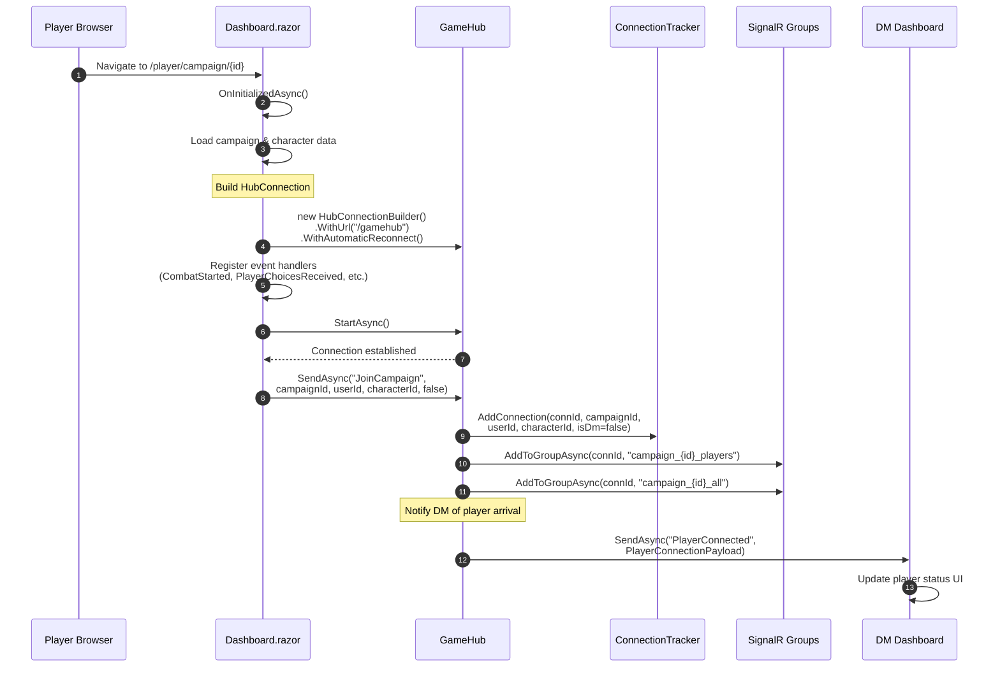
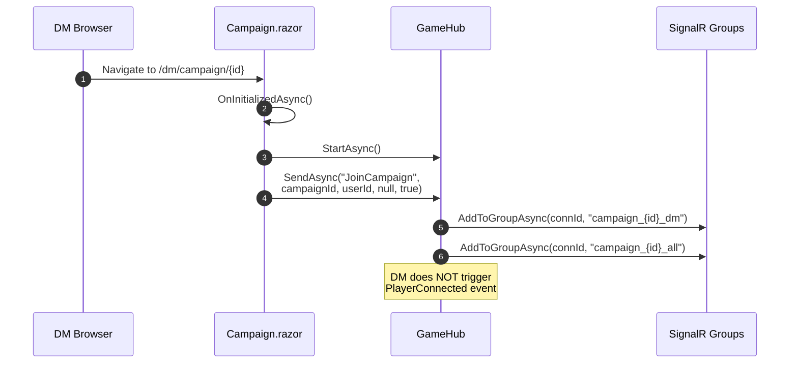
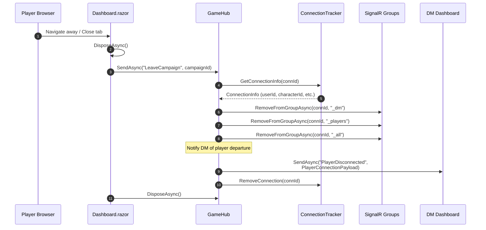
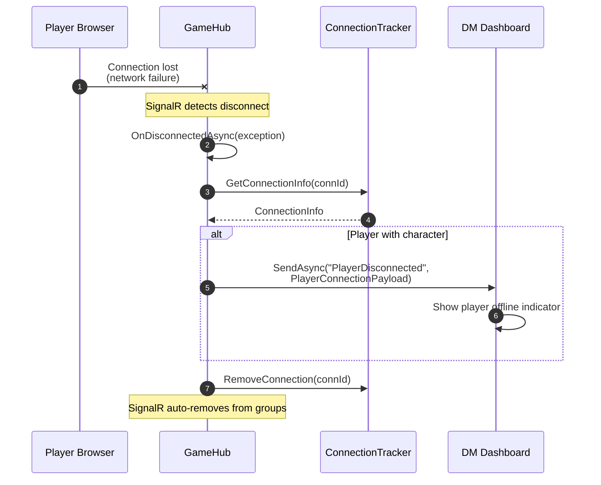
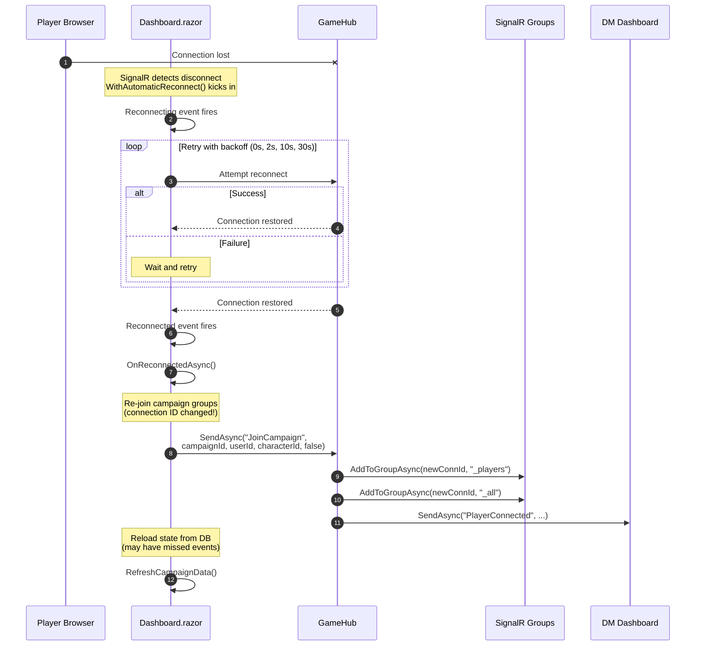
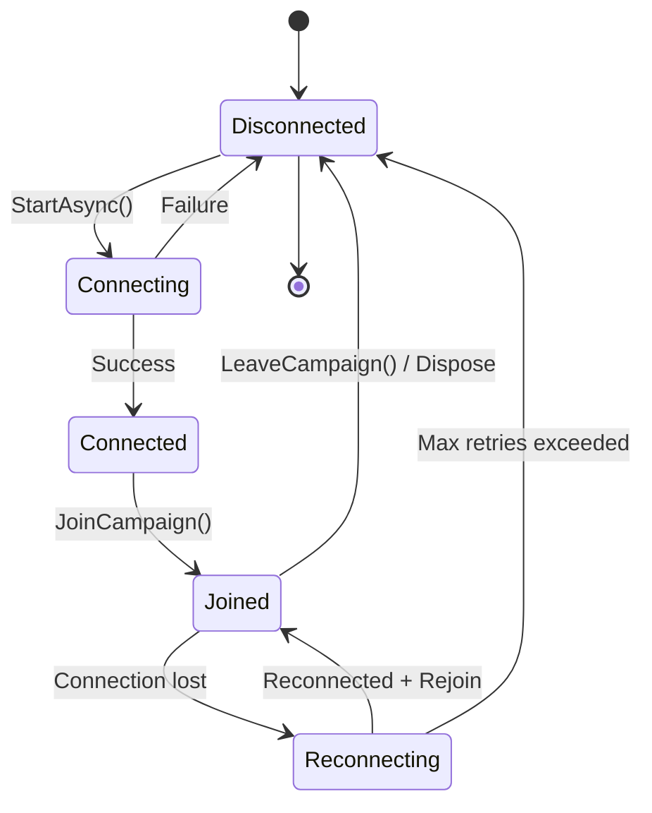

# Player Lifecycle Flow

This document describes the SignalR communication flow for player connections, including joining a campaign, maintaining connection, handling disconnects, and reconnection scenarios.

## Overview

The player lifecycle involves several key phases:
1. **Initial Connection** - Player dashboard loads and connects to SignalR
2. **Campaign Join** - Player joins the campaign's SignalR groups
3. **Active Session** - Player receives events and submits actions
4. **Disconnection** - Browser close, navigation away, or network loss
5. **Reconnection** - Automatic reconnection after network issues

## 1. Player Joins Campaign

When a player navigates to the player dashboard (`/player/campaign/{id}`):



### Code Reference (Dashboard.razor)

```csharp
protected override async Task OnAfterRenderAsync(bool firstRender)
{
    if (firstRender)
    {
        _hubConnection = new HubConnectionBuilder()
            .WithUrl(Navigation.ToAbsoluteUri("/gamehub"))
            .WithAutomaticReconnect()
            .Build();
        
        // Register event handlers...
        _hubConnection.On<CombatStatePayload>(GameHubEvents.CombatStarted, ...);
        _hubConnection.On<List<string>>(GameHubEvents.PlayerChoicesReceived, ...);
        // etc.
        
        await _hubConnection.StartAsync();
        await _hubConnection.SendAsync("JoinCampaign", CampaignId, currentUserId, 
            selectedCharacter?.Id.ToString(), false);
    }
}
```

## 2. DM Joins Campaign

The DM flow is similar but uses `isDm=true`:



## 3. Player Disconnection (Explicit)

When a player navigates away or closes the tab:



### Code Reference (Dashboard.razor)

```csharp
public async ValueTask DisposeAsync()
{
    if (_hubConnection != null)
    {
        try
        {
            await _hubConnection.SendAsync("LeaveCampaign", CampaignId);
        }
        catch { /* Ignore errors during cleanup */ }
        
        await _hubConnection.DisposeAsync();
    }
}
```

## 4. Player Disconnection (Unexpected)

When the connection is lost due to network issues or browser crash:



### Code Reference (GameHub.cs)

```csharp
public override async Task OnDisconnectedAsync(Exception? exception)
{
    var connectionInfo = _connectionTracker.GetConnectionInfo(Context.ConnectionId);
    
    if (connectionInfo != null)
    {
        if (!connectionInfo.IsDm && connectionInfo.CharacterId != null)
        {
            await Clients.Group($"campaign_{connectionInfo.CampaignId}_dm").SendAsync(
                GameHubEvents.PlayerDisconnected,
                new PlayerConnectionPayload(...));
        }
    }
    
    _connectionTracker.RemoveConnection(Context.ConnectionId);
    await base.OnDisconnectedAsync(exception);
}
```

## 5. Automatic Reconnection

SignalR's automatic reconnection handles transient network issues:



### Code Reference (Dashboard.razor)

```csharp
// Setup reconnection handler
_hubConnection.Reconnected += OnReconnectedAsync;

private async Task OnReconnectedAsync(string? connectionId)
{
    try
    {
        // Re-join campaign group after reconnection
        await _hubConnection!.SendAsync("JoinCampaign", CampaignId, 
            currentUserId, selectedCharacter?.Id.ToString(), false);
        
        // Reload campaign data to catch up on any missed events
        await RefreshCampaignData();
    }
    catch (Exception ex)
    {
        Logger.LogError(ex, "Failed to rejoin campaign after reconnection");
    }
}
```

## State Diagram



## Key Points

1. **Connection ID changes on reconnect**: When SignalR reconnects, the connection ID may change. The client must re-join groups after reconnection.

2. **Automatic reconnect timing**: Default backoff is 0s, 2s, 10s, 30s. After 4 failed attempts, the connection is closed.

3. **State recovery**: After reconnection, the client should reload state from the database since events may have been missed during disconnection.

4. **DM notification**: The DM is always notified when players connect/disconnect (via `PlayerConnected`/`PlayerDisconnected` events).

5. **Multiple tabs**: Each browser tab creates a separate connection. Closing one tab doesn't affect others.
