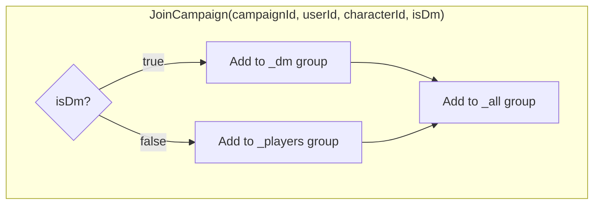
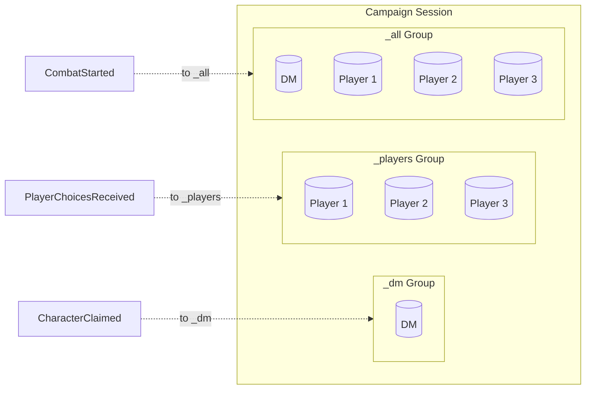

# SignalR Groups

SignalR groups enable targeted message broadcasting to subsets of connected clients. Project Riddle uses a campaign-scoped grouping strategy with three distinct groups per active campaign.

## Group Naming Convention

All groups follow the pattern: `campaign_{campaignId}_{scope}`

| Group Pattern | Scope | Members |
|---------------|-------|---------|
| `campaign_{id}_dm` | DM only | Single DM connection |
| `campaign_{id}_players` | Players only | All player connections |
| `campaign_{id}_all` | Everyone | DM + all players |

### Example

For campaign `a1b2c3d4-e5f6-7890-abcd-ef1234567890`:
- `campaign_a1b2c3d4-e5f6-7890-abcd-ef1234567890_dm`
- `campaign_a1b2c3d4-e5f6-7890-abcd-ef1234567890_players`
- `campaign_a1b2c3d4-e5f6-7890-abcd-ef1234567890_all`

## Group Membership Rules



### Code Implementation

From `GameHub.cs`:

```csharp
public async Task JoinCampaign(Guid campaignId, string userId, string? characterId, bool isDm)
{
    var dmGroup = $"campaign_{campaignId}_dm";
    var playersGroup = $"campaign_{campaignId}_players";
    var allGroup = $"campaign_{campaignId}_all";
    
    if (isDm)
    {
        await Groups.AddToGroupAsync(Context.ConnectionId, dmGroup);
    }
    else
    {
        await Groups.AddToGroupAsync(Context.ConnectionId, playersGroup);
    }
    await Groups.AddToGroupAsync(Context.ConnectionId, allGroup);
    
    _connectionTracker.AddConnection(Context.ConnectionId, campaignId, userId, characterId, isDm);
}
```

## Group Usage by Event Type

| Target Group | Used For | Events |
|--------------|----------|--------|
| `_dm` | DM-only notifications | `CharacterClaimed`, `CharacterReleased`, `PlayerConnected`, `PlayerDisconnected`, `PlayerChoiceSubmitted`, `ReadAloudTextReceived` |
| `_players` | Player-only broadcasts | `PlayerChoicesReceived`, `AtmospherePulseReceived`, `NarrativeAnchorUpdated`, `GroupInsightTriggered` |
| `_all` | Universal broadcasts | `CharacterStateUpdated`, `SceneImageUpdated`, `PlayerRollLogged`, `CombatStarted`, `CombatEnded`, `TurnAdvanced`, `InitiativeSet`, `DeathSaveUpdated` |

## Visual Representation



## Server-Side Group Access

The `NotificationService` uses helper methods to construct group names:

```csharp
private static string DmGroup(Guid campaignId) => $"campaign_{campaignId}_dm";
private static string PlayersGroup(Guid campaignId) => $"campaign_{campaignId}_players";
private static string AllGroup(Guid campaignId) => $"campaign_{campaignId}_all";
```

## Group Cleanup

Groups are automatically cleaned up when clients disconnect or explicitly leave:

```csharp
public async Task LeaveCampaign(Guid campaignId)
{
    await Groups.RemoveFromGroupAsync(Context.ConnectionId, $"campaign_{campaignId}_dm");
    await Groups.RemoveFromGroupAsync(Context.ConnectionId, $"campaign_{campaignId}_players");
    await Groups.RemoveFromGroupAsync(Context.ConnectionId, $"campaign_{campaignId}_all");
    
    _connectionTracker.RemoveConnection(Context.ConnectionId);
}
```

**Note:** SignalR automatically removes a connection from all groups when it disconnects, but we explicitly call `LeaveCampaign` for clean state management and to notify the DM of player departures.

## Important Considerations

1. **Multiple connections per user**: A user can have multiple browser tabs open. Each tab creates a separate connection and joins groups independently.

2. **DM reconnection**: If the DM disconnects and reconnects, they rejoin the `_dm` group automatically via `JoinCampaign`.

3. **Character association**: The `characterId` parameter in `JoinCampaign` is tracked but not used for group membership—it's metadata for the `ConnectionTracker` to identify which character a player is controlling.

4. **No cross-campaign isolation**: Groups are scoped by `campaignId`, so events from one campaign never leak to another.
