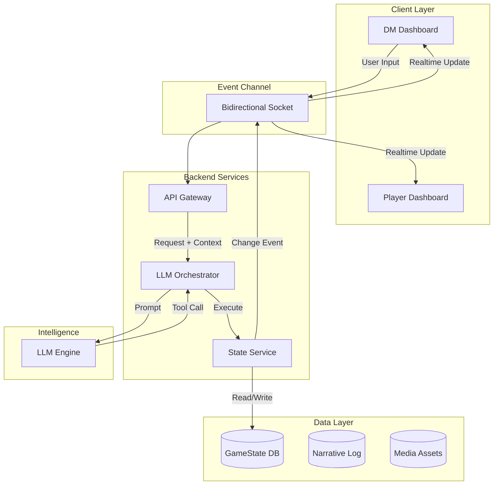

# Software Design Document: Project Riddle

**Version:** 1.0  
**Status:** Draft  
**Target Audience:** Software Development Team, UI/UX Designers

---

## 1. Introduction
Project **Riddle** is a software assistant for Dungeon Masters running the "Lost Mine of Phandelver" campaign for Dungeons & Dragons 5th Edition. It leverages a Large Language Model (LLM) to act as the game's logic engine and narrator, while the software maintains persistent state, manages the user interface, and handles real-time communication between the Dungeon Master (DM) and Players.

### 1.1 Core Philosophy
*   **LLM as Brain:** The LLM holds the module knowledge, rules, and narrative capability.
*   **Software as Body:** The software holds the persistent memory (GameState), executes the LLM's tool commands, and presents the UI.
*   **Stateless Operation:** The system must handle the LLM's context limits by treating every interaction as potentially stateless, relying on a robust `GameState` store for recovery.

---

## 2. System Architecture

The system is built on an event-driven architecture utilizing a persistent, bidirectional channel (e.g., WebSockets/SignalR) to synchronize the Stateless LLM with the Stateful Client.

### 2.1 High-Level Architecture



### 2.2 State Recovery Flow
This flow dictates how the system handles the "New Conversation" constraint where LLM memory is wiped.


---

## 3. Data Design (The State)

The `RiddleSession` object is the Single Source of Truth. It is stored in a NoSQL document store (JSON) to allow flexible schema evolution.

### 3.1 Root Object: `RiddleSession`

```python
class RiddleSession:
    session_id: str
    campaign_name: str
    created_at: datetime
    
    # Progression
    campaign_progress: CampaignProgress
    active_quests: List[Quest]
    
    # Entities
    party_state: List[Character]
    active_combat: Optional[CombatEncounter]
    
    # Context/Meta
    narrative_log: List[LogEntry]
    party_preferences: PartyPreferences
    
    # UI Transients
    active_player_choices: List[str]
    current_scene_image_uri: str
```

### 3.2 Campaign Progression

```python
class CampaignProgress:
    current_chapter_id: str
    current_location_id: str
    
    # State Machine Flags
    completed_milestones: List[str] 
    known_npc_ids: List[str]
    discovered_locations: List[str]
```

### 3.3 Quests & Preferences

```python
class Quest:
    quest_id: str
    title: str
    state: str              # "Active", "Completed", "Failed"
    is_main_story: bool
    objectives: List[str]

class PartyPreferences:
    combat_focus: str       # "Low", "Medium", "High"
    roleplay_focus: str     # "Low", "Medium", "High"
    pacing: str             # "Fast", "Methodical"
    avoided_topics: List[str]
```

### 3.4 Character & Combat

```python
class Character:
    id: str
    name: str
    type: str               # "PC" or "NPC"
    armor_class: int
    max_hp: int
    current_hp: int
    initiative: int
    perception_passive: int
    conditions: List[str]
    status_notes: str       # e.g. "Hidden Enemies Spotted"

class CombatEncounter:
    encounter_id: str
    is_active: bool
    round_number: int
    turn_order: List[str]
    current_turn_index: int
    surprised_entities: List[str]
```

---

## 4. LLM Tool Functions

The LLM interacts with the software exclusively through these tools.

### 4.1 State & Memory

```python
def get_game_state() -> dict:
    """
    CRITICAL: First call in any new conversation.
    Retrieves the full RiddleSession JSON.
    """
    pass

def update_game_log(entry: str, importance: str = "standard") -> void:
    """
    Writes to the persistent Narrative Log.
    Used to compress history for future context recovery.
    """
    pass
```

### 4.2 Logic Manipulation

```python
def update_character_state(character_id: str, key: str, value: any) -> void:
    """
    Updates HP, Conditions, Initiative, or Status Notes.
    Triggers UI updates via Event Channel.
    """
    pass

def log_player_roll(character_id: str, check_type: str, result: int, outcome: str) -> void:
    """
    Records a roll to the Player Dashboard.
    Examples: "Perception", 16, "Success"
    """
    pass
```

### 4.3 Presentation & Player Interface

```python
def display_read_aloud_text(text: str) -> void:
    """
    Populates the DM's 'Read Aloud Text Box' (RATB).
    """
    pass

def present_player_choices(choices: List[str]) -> void:
    """
    Sends buttons to Player Screens.
    Input: ["Attack", "Hide", "Talk"]
    """
    pass

def update_scene_image(description: str) -> void:
    """
    Triggers an image update on Player/DM screens based on description.
    """
    pass
```

---

## 5. Logging Strategy

To manage the LLM's token limit, we employ a **Compressed Memory** strategy.

1.  **The Event Log (`LogEntry`):** Every time the LLM takes an action (e.g., "Combat started"), it calls `update_game_log`.
2.  **The Summary (`last_narrative_summary`):** Periodically (or when the conversation approaches the token limit), a background process compresses the `LogEntry` list into a single text paragraph stored in `RiddleSession.last_narrative_summary`.
3.  **Recovery:** On `get_game_state()`, only the `last_narrative_summary` is sent to the LLM, not the full history of log entries, saving tokens while maintaining context.

---

## 6. User Interface Specifications

### 6.1 Dungeon Master (DM) Interface
The DM acts as the operator.

*   **Read Aloud Text Box (RATB):** (Max 65k chars). A large, prominent text area for the DM to read from.
*   **DM/LLM Chat:** A standard chat interface for the DM to provide inputs and receive private logic/advice.
*   **GameState Dashboard:**
    *   **Party Tab:** List of all PCs with HP bars, Conditions, and Notes.
    *   **Combat Tab:** Turn order tracker, Round counter, Surprise indicators.
    *   **Quest Tab:** Active quests and progress.
*   **DM Controls:** Manual override buttons (Force Next Turn, Heal, Damage).

### 6.2 Player Interface
The Player acts as a participant. This view is restricted.

*   **Character Card:** Shows only *their* character's stats (HP, Class, Level).
*   **Scene Visual:** Large display of the `current_scene_image_uri`.
*   **Choice Pad:** A dynamic area rendering the buttons sent via `present_player_choices`.
*   **Log:** A read-only log of recent public events (e.g., "The Fighter hit the Goblin").

### 6.3 Multiplayer Realtime Chat (Placeholder)
*   **Requirement:** A text channel for "Table Talk" between players that does NOT interrupt the LLM's logic stream.
*   **Channels:**
    *   `#table-talk`: Public chat for all players and DM.
    *   `#dm-private`: Direct message to DM only.
*   **Tech Stack:** Must use the same Event Channel (WebSockets/SignalR) to ensure messages appear instantly without page refreshes.

---

## 7. Implementation Checklist

1.  [ ] **Database Schema:** Implement `RiddleSession`, `Character`, and `CampaignProgress` models.
2.  [ ] **Event Channel:** Establish WebSocket/SignalR connection for real-time UI pushing.
3.  [ ] **LLM Integration:** Build the Tool Router (maps LLM JSON function calls to Python/C# backend methods).
4.  [ ] **State Recovery:** Implement the logic to inject `GameState` into the System Prompt on conversation reset.
5.  [ ] **Frontend - DM:** Build RATB and Chat interface.
6.  [ ] **Frontend - Player:** Build Character Card and Choice Pad.