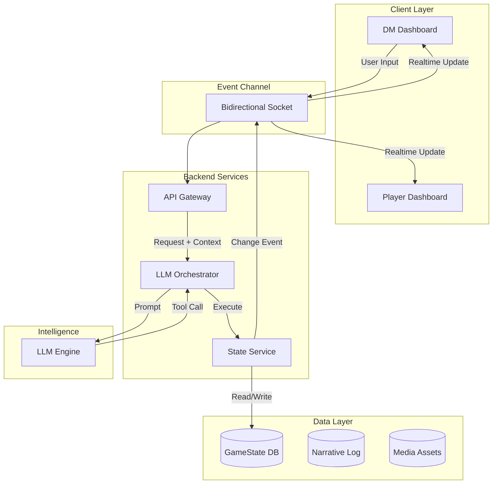
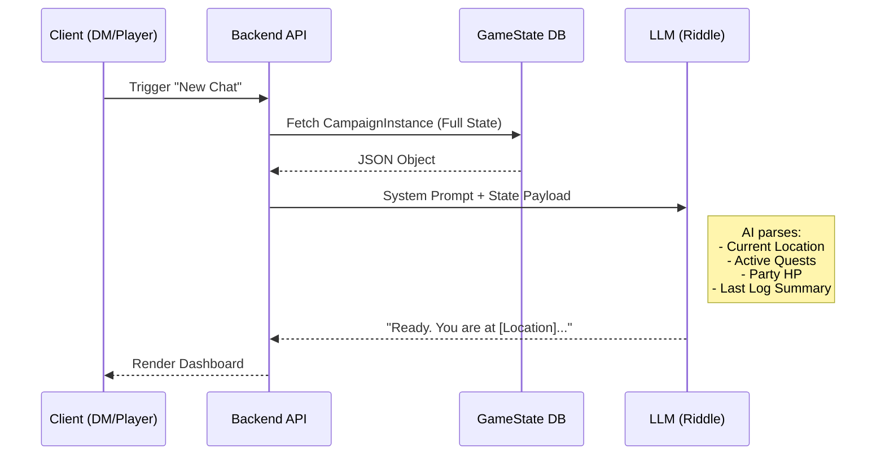

# Software Design Document: Project Riddle

**Version:** 1.0  
**Status:** Draft  
**Target Audience:** Software Development Team, UI/UX Designers

---

## 1. Introduction
Project **Riddle** is a software assistant for Dungeon Masters running the "Lost Mine of Phandelver" campaign for Dungeons & Dragons 5th Edition. It leverages a Large Language Model (LLM) to act as the game's logic engine and narrator, while the software maintains persistent state, manages the user interface, and handles real-time communication between the Dungeon Master (DM) and Players.

### 1.1 Core Philosophy
*   **LLM as Brain:** The LLM holds the module knowledge, rules, and narrative capability.
*   **Software as Body:** The software holds the persistent memory (GameState), executes the LLM's tool commands, and presents the UI.
*   **Stateless Operation:** The system must handle the LLM's context limits by treating every interaction as potentially stateless, relying on a robust `GameState` store for recovery.

---

## 2. System Architecture

The system is built on an event-driven architecture utilizing a persistent, bidirectional channel (e.g., WebSockets/SignalR) to synchronize the Stateless LLM with the Stateful Client.

### 2.1 High-Level Architecture



### 2.2 State Recovery Flow
This flow dictates how the system handles the "New Conversation" constraint where LLM memory is wiped.



---

## 3. Data Design (The State)

The data model is organized around two key concepts: **CampaignInstance** (the entire adventure) and **PlaySession** (an individual game night). This separation allows Riddle to maintain proper context across the LLM's stateless nature while tracking progress at both the campaign and session level.

### 3.1 Root Object: `CampaignInstance`

The `CampaignInstance` is the Single Source of Truth for an entire adventure playthrough. It persists all game state across multiple play sessions.

```python
class CampaignInstance:
    id: str                           # Unique identifier (UUID v7)
    name: str                         # e.g., "Tuesday Night Group"
    campaign_module: str              # e.g., "Lost Mine of Phandelver"
    dm_user_id: str                   # Owner/DM's user ID
    created_at: datetime
    
    # Multiplayer Invite
    invite_code: str                  # e.g., "ABC123" - persistent join link
    
    # Progression (persistent across all play sessions)
    current_chapter_id: str
    current_location_id: str
    completed_milestones: List[str]
    known_npc_ids: List[str]
    discovered_locations: List[str]
    
    # Quests
    active_quests: List[Quest]
    
    # Entities
    party_state: List[Character]
    active_combat: Optional[CombatEncounter]
    
    # Context/Memory (for LLM recovery)
    narrative_log: List[LogEntry]
    last_narrative_summary: str       # Compressed memory for token efficiency
    
    # Preferences
    party_preferences: PartyPreferences
    
    # World State (for Player Dashboard display)
    time_of_day: str                  # e.g., "Morning", "Dusk", "Midnight"
    weather: str                      # e.g., "Clear", "Raining", "Foggy"
    
    # UI Transients (current display state)
    current_read_aloud_text: str
    current_scene_image_uri: str
    active_player_choices: List[str]
    
    # Navigation
    play_sessions: List[PlaySession]
```

### 3.2 Child Object: `PlaySession`

A `PlaySession` represents a single game night within a `CampaignInstance`. It tracks session-specific metadata and bookmarks.

```python
class PlaySession:
    id: str                           # Unique identifier (UUID v7)
    campaign_instance_id: str         # Foreign key to parent CampaignInstance
    
    session_number: int               # Sequential: "Session 3"
    started_at: datetime
    ended_at: Optional[datetime]
    is_active: bool                   # Currently in progress?
    
    # Bookmarks (where we started/ended this session)
    start_location_id: str
    end_location_id: Optional[str]
    
    # Session-specific notes
    dm_notes: str                     # Private DM notes for this session
    key_events: List[str]             # Highlights: "Rescued Sildar", "Found the map"
```

### 3.3 Entity Hierarchy Example

```
CampaignInstance: "Tuesday Night Group"
│   id: "550e8400-e29b-41d4-a716-446655440000"
│   campaign_module: "Lost Mine of Phandelver"
│   current_chapter_id: "chapter_2"
│   current_location_id: "cragmaw_hideout"
│   party_state: [Thorin, Luna, Shade]
│   narrative_log: [LogEntry, LogEntry, ...]
│   last_narrative_summary: "The party defeated the goblin ambush..."
│
└── PlaySessions:
    ├── PlaySession #1 (Sept 1)
    │   session_number: 1
    │   start_location_id: "triboar_trail"
    │   end_location_id: "goblin_ambush_site"
    │   key_events: ["Character creation", "Goblin ambush"]
    │
    ├── PlaySession #2 (Sept 8)
    │   session_number: 2
    │   start_location_id: "goblin_ambush_site"
    │   end_location_id: "cragmaw_hideout_entrance"
    │   key_events: ["Tracked goblins", "Found hideout"]
    │
    └── PlaySession #3 (Sept 15) [ACTIVE]
        session_number: 3
        is_active: true
        start_location_id: "cragmaw_hideout_entrance"
        key_events: ["Rescued Sildar"]
```

### 3.4 Quests & Preferences

```python
class Quest:
    quest_id: str
    title: str
    state: str              # "Active", "Completed", "Failed"
    is_main_story: bool
    objectives: List[str]

class PartyPreferences:
    combat_focus: str       # "Low", "Medium", "High"
    roleplay_focus: str     # "Low", "Medium", "High"
    pacing: str             # "Fast", "Methodical"
    avoided_topics: List[str]
```

### 3.5 Character Templates (Reusable Character Library)

Character templates provide a library of pre-made characters that DMs can import into campaigns. Templates are stored separately from campaign-specific characters.

```python
class CharacterTemplate:
    id: str                           # UUID v7
    name: str                         # e.g., "Gandalf"
    owner_id: str | None              # NULL = system template, user_id = private template
    character_json: str               # Full Character model serialized as JSON
    
    # Shadow columns (denormalized for filtering/display)
    race: str                         # e.g., "Aasimar"
    character_class: str              # e.g., "Cleric"
    level: int
    source_file: str | None           # Original JSON filename for system templates
    
    created_at: datetime
    updated_at: datetime
```

**DM Workflow:**
1. DM opens character picker in campaign setup
2. DM browses system templates (Gandalf, Katniss, etc.) or their own templates
3. DM selects a template → Template is copied into campaign's `PartyState` with a fresh ID
4. Character appears in party, ready for player claim via invite link

**Template Types:**
- **System Templates:** `owner_id = NULL`, available to all DMs, seeded from `SampleCharacters/*.json`
- **User Templates:** `owner_id = user_id`, private to the DM who created them

### 3.6 Character (Full D&D 5e Sheet)

The Character model supports full D&D 5th Edition character sheets, enabling both manual entry and LLM-assisted parsing from uploaded PDFs/images.

```python
class Character:
    # Identity
    id: str                           # UUID v7 for time-ordered sorting
    name: str
    avatar_image_uri: str             # Character portrait
    type: str                         # "PC" or "NPC"
    
    # Player Link (for multiplayer)
    player_id: str                    # Google user ID (null until claimed)
    player_name: str                  # Display name of the player
    
    # Core Identity
    race: str                         # e.g., "Hill Dwarf"
    character_class: str              # e.g., "Fighter"
    level: int                        # Current level
    experience_points: int            # XP total
    background: str                   # e.g., "Soldier"
    
    # Ability Scores
    strength: int
    dexterity: int
    constitution: int
    intelligence: int
    wisdom: int
    charisma: int
    
    # Combat Stats
    armor_class: int
    max_hp: int
    current_hp: int
    temp_hp: int                      # Temporary hit points
    initiative: int                   # Initiative modifier
    speed: str                        # e.g., "30 ft"
    
    # Skills & Senses
    passive_perception: int
    proficiencies: List[str]          # Skills, tools, weapons, armor
    saving_throws: List[str]          # Proficient saving throws
    
    # Features & Spellcasting
    features: List[str]               # Class features, racial traits
    spells: List[str]                 # Known/prepared spells
    spellcasting_ability: str         # e.g., "Intelligence"
    spell_save_dc: int
    spell_attack_bonus: int
    
    # Equipment
    equipment: List[str]              # Weapons, armor, items
    currency: str                     # e.g., "15 GP, 3 SP"
    
    # Status (mutable during play)
    conditions: List[str]             # e.g., ["Poisoned", "Prone"]
    status_notes: str                 # DM notes, e.g., "Has secret map"
    
    # Roleplay (optional)
    personality_traits: str
    ideals: str
    bonds: str
    flaws: str

class CombatEncounter:
    encounter_id: str
    is_active: bool
    round_number: int
    turn_order: List[str]
    current_turn_index: int
    surprised_entities: List[str]
```

### 3.7 Narrative Log Entry

```python
class LogEntry:
    id: str
    timestamp: datetime
    entry_type: str         # "narrative", "combat", "decision", "milestone"
    content: str
    importance: str         # "minor", "standard", "major"
```

---

## 4. LLM Tool Functions

The LLM interacts with the software exclusively through these tools.

### 4.1 State & Memory

```python
def get_game_state() -> dict:
    """
    CRITICAL: First call in any new conversation.
    Retrieves the full CampaignInstance JSON for context recovery.
    """
    pass

def update_game_log(entry: str, importance: str = "standard") -> void:
    """
    Writes to the persistent Narrative Log.
    Used to compress history for future context recovery.
    """
    pass
```

### 4.2 Logic Manipulation

```python
def update_character_state(character_id: str, key: str, value: any) -> void:
    """
    Updates HP, Conditions, Initiative, or Status Notes.
    Triggers UI updates via Event Channel.
    """
    pass

def log_player_roll(character_id: str, check_type: str, result: int, outcome: str) -> void:
    """
    Records a roll to the Player Dashboard.
    Examples: "Perception", 16, "Success"
    """
    pass
```

### 4.3 Presentation & Player Interface

```python
def display_read_aloud_text(text: str) -> void:
    """
    Populates the DM's 'Read Aloud Text Box' (RATB).
    """
    pass

def present_player_choices(choices: List[str]) -> void:
    """
    Sends buttons to Player Screens.
    Input: ["Attack", "Hide", "Talk"]
    """
    pass

def update_scene_image(description: str) -> void:
    """
    Triggers an image update on Player/DM screens based on description.
    """
    pass
```

---

## 5. Logging Strategy

To manage the LLM's token limit, we employ a **Compressed Memory** strategy.

1.  **The Event Log (`LogEntry`):** Every time the LLM takes an action (e.g., "Combat started"), it calls `update_game_log`.
2.  **The Summary (`last_narrative_summary`):** Periodically (or when the conversation approaches the token limit), a background process compresses the `LogEntry` list into a single text paragraph stored in `CampaignInstance.last_narrative_summary`.
3.  **Recovery:** On `get_game_state()`, only the `last_narrative_summary` is sent to the LLM, not the full history of log entries, saving tokens while maintaining context.

---

## 6. User Interface Specifications

### 6.1 Dungeon Master (DM) Interface
The DM acts as the operator.

*   **Read Aloud Text Box (RATB):** (Max 65k chars). A large, prominent text area for the DM to read from.
*   **DM/LLM Chat:** A standard chat interface for the DM to provide inputs and receive private logic/advice.
*   **GameState Dashboard:**
    *   **Party Tab:** List of all PCs with HP bars, Conditions, and Notes.
    *   **Combat Tab:** Turn order tracker, Round counter, Surprise indicators.
    *   **Quest Tab:** Active quests and progress.
*   **DM Controls:** Manual override buttons (Force Next Turn, Heal, Damage).

### 6.2 Player Interface
The Player acts as a participant. This view is restricted.

*   **Character Card:** Shows only *their* character's stats (HP, Class, Level).
*   **Scene Visual:** Large display of the `current_scene_image_uri`.
*   **Choice Pad:** A dynamic area rendering the buttons sent via `present_player_choices`.
*   **Log:** A read-only log of recent public events (e.g., "The Fighter hit the Goblin").

### 6.3 Multiplayer Realtime Chat (Placeholder)
*   **Requirement:** A text channel for "Table Talk" between players that does NOT interrupt the LLM's logic stream.
*   **Channels:**
    *   `#table-talk`: Public chat for all players and DM.
    *   `#dm-private`: Direct message to DM only.
*   **Tech Stack:** Must use the same Event Channel (WebSockets/SignalR) to ensure messages appear instantly without page refreshes.

---

## 7. Implementation Checklist

1.  [ ] **Database Schema:** Implement `CampaignInstance`, `PlaySession`, `Character`, and related models.
2.  [ ] **Event Channel:** Establish WebSocket/SignalR connection for real-time UI pushing.
3.  [ ] **LLM Integration:** Build the Tool Router (maps LLM JSON function calls to C# backend methods).
4.  [ ] **State Recovery:** Implement the logic to inject `CampaignInstance` state into the System Prompt on conversation reset.
5.  [ ] **Frontend - DM:** Build RATB and Chat interface.
6.  [ ] **Frontend - Player:** Build Character Card and Choice Pad.
